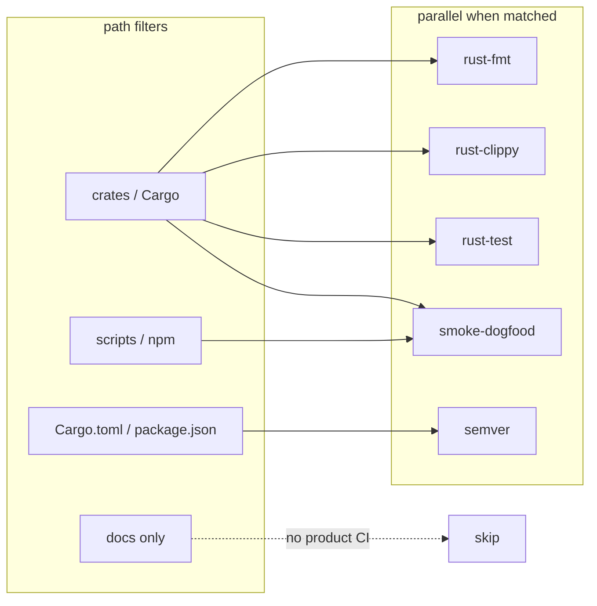

# GitHub Actions

Product CI only — **no process-police** (no PR title regex, kind-label counters, markdown path inventories).

## Workflows (split + path-gated)

Jobs are **separate workflows** so they:

1. **Skip entirely** when paths do not match (docs-only PR → no Rust CI).
2. **Run in parallel** when multiple paths match (fmt ∥ clippy ∥ test ∥ smoke).
3. **Share Cargo caches** via Swatinem `shared-key: workspace-v1` (write mainly on `main`).

| Workflow | File | Runs when | What |
|----------|------|-----------|------|
| **rust-fmt** | [`rust-fmt.yml`](./rust-fmt.yml) | `crates/**`, Cargo/*, rustfmt | `cargo fmt --check` |
| **rust-clippy** | [`rust-clippy.yml`](./rust-clippy.yml) | `crates/**`, Cargo/*, clippy.toml | `cargo clippy --workspace` |
| **rust-test** | [`rust-test.yml`](./rust-test.yml) | `crates/**`, Cargo/* | `cargo test --workspace` |
| **smoke-dogfood** | [`smoke-dogfood.yml`](./smoke-dogfood.yml) | crates + scripts + package/npm | offline `./scripts/smoke-dogfood.sh` |
| **semver** | [`semver.yml`](./semver.yml) | `Cargo.toml` / `package.json` only | version match (no compile) |



## Caching

| Setting | Value | Why |
|---------|--------|-----|
| Action | `Swatinem/rust-cache@v2` | registry + git + target |
| `shared-key` | `workspace-v1` | fmt/clippy/test/smoke share warm deps |
| `save-if` | `main` only | PRs read cache; avoid PR stampede writes |
| `cache-on-failure` | `true` | recover next run after red |

Bump `shared-key` (e.g. `workspace-v2`) if the cache key needs a hard invalidate.

## What we intentionally do **not** run

| Not in CI | Reason |
|-----------|--------|
| Live DeepSeek API | Needs secrets; optional local only |
| npm publish | Owner-gated (ADR 0007) |
| Full monorepo rebuild after each job in one YAML | Split workflows + shared cache |
| Process CI (title/label fashion) | Docs + review harness |

## Local mirrors

```bash
# fmt
cargo fmt --all -- --check

# clippy
cargo clippy --workspace --all-targets -- -W clippy::all

# tests
cargo test --workspace

# smoke (offline)
./scripts/smoke-dogfood.sh

# semver only
./scripts/check-semver.sh
node npm/scripts/check-version-match.js
```

## When to add a new workflow

1. Does a **path-filtered** unit/integration **test** already cover it? Prefer that.
2. Which **lane**: cheap PR gate vs main-only vs release-only?
3. Can it **parallel** with existing jobs without a mega-job?
4. Does it need a **new path filter** so unrelated PRs stay quiet?

Do **not** reintroduce a single `ci.yml` that runs fmt+clippy+test+smoke serially for every PR.
