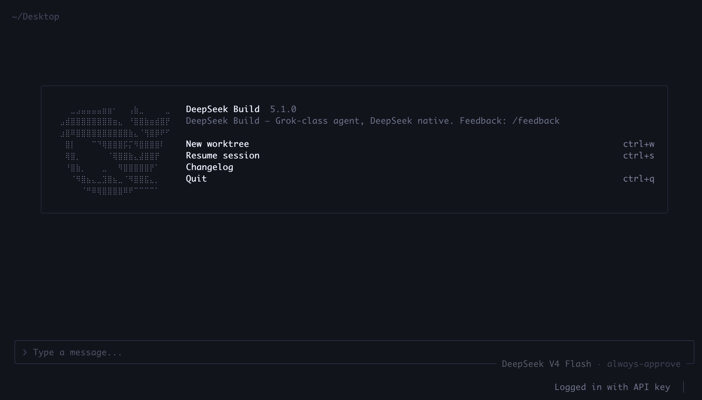

<div align="center">

[English](README.md) · [简体中文](README.zh-CN.md) · **日本語** · [한국어](README.ko-KR.md)

<!-- 一時的な hero 画像の出典: deepseek-ai/DeepSeek-V2 figures/logo.svg（DeepSeek-V3 でも使用）。 -->
<a href="https://github.com/deepseek-ai/DeepSeek-V3">
  
</a>

<h1>DeepSeek Build</h1>

<p><strong>DeepSeek ネイティブなコーディング。Grok 級の実行。</strong></p>

<p>
  DeepSeek モデルを中心に設計された、安全な編集・キャッシュ認識セッション・
  並列実行を備えたフルスクリーンのターミナルコーディングエージェントです。
</p>

<p>
  <a href="https://github.com/innocarpe/deepseek-build/releases"></a>
  <a href="https://www.npmjs.com/package/@innocarpe/deepseek-build"></a>
  <a href="LICENSE"></a>
</p>

<p>
  <a href="#クイックスタート">クイックスタート</a> ·
  <a href="#なぜ-deepseek-build-か">なぜ DeepSeek Build か</a> ·
  <a href="#仕組み">仕組み</a> ·
  <a href="#ドキュメント">ドキュメント</a> ·
  <a href="#コントリビューション">コントリビューション</a>
</p>

</div>

<p align="center">
  
</p>

## クイックスタート

npm からインストールし、DeepSeek API キーを追加して TUI を開きます:

```bash
npm install -g @innocarpe/deepseek-build
deepseek-build setup
deepseek-build
```

レジストリ版は Node.js 18 以上が必要で、対応するリリースアセットがあれば
プリビルドバイナリを使用します。この経路では Rust は不要です。プラットフォーム
とソースフォールバックの詳細は [npm インストールガイド](docs/user-guide/05-npm.md) を
参照してください。

`deepseek-build` がプライマリコマンドです。`dsb` は同じ動作を持つ完全サポートの
短いエイリアスで、完全なセマンティックバージョンを持ちます:

```bash
deepseek-build --version
dsb --version
```

インストーラが製品 bin ディレクトリが `PATH` にないと報告した場合は、起動前に
追加してください:

```bash
export PATH="$HOME/.deepseek-build/bin:$PATH"
```

## なぜ DeepSeek Build か

| 能力 | 意味 |
| --- | --- |
| **DeepSeek ネイティブ** | DeepSeek API デフォルト、Flash/Pro ルーティング、reasoning effort、DeepSeek ブランドの TUI。 |
| **安全な編集** | バージョン束縛のスニペット編集とフェイルクローズのワークスペース権限。サイレントな全ファイル置換はしません。 |
| **長セッションの経済性** | 安定したプロンプトプレフィックス、遅延スキル読み込み、ツールコール修復により、再開セッションを一貫性・キャッシュ親和性のある状態に保ちます。 |
| **スループット** | 並列ツール、バックグラウンドシェルジョブ、サブエージェント、オプトインの worktree を安全層・キャッシュ層の下で実行します。 |
| **永続セッション** | 直近のフルスクリーンセッションを再開するか、保存済みセッションに直接移動します。 |

その結果は、Grok 由来の実行エンジンの速さを保ちながら、DeepSeek 固有のコスト・
編集・権限ルールを製品経路に組み込んだコーディングエージェントです。

## 日常的な使い方

```bash
# フルスクリーン TUI を開く
deepseek-build

# 直近のフルスクリーンセッションを再開
deepseek-build --resume

# 非対話ターンを 1 回実行
deepseek-build run "Explain the architecture of this repository."

# 信頼済みのローカルコーディングプロファイルを使用
deepseek-build --dogfood
```

`--dogfood` は現在のワークスペース内の書き込みを許可し、ポリシー下でのシェル
実行を有効にします。ワークスペース外の書き込み・削除は引き続き拒否されます。

短いコマンドを使う場合は、例の `deepseek-build` を `dsb` に置き換えてください。

## 認証と設定

対話型セットアップは API キーを `0600` 権限で
`~/.deepseek-build/credentials.json` に保存します:

```bash
deepseek-build setup
deepseek-build auth status
deepseek-build auth logout
```

CI など非対話環境では `DEEPSEEK_API_KEY` を設定してください。環境変数は
資格情報ファイルより優先されます。製品設定・資格情報・セッション・ユーザースキルは
デフォルトで `~/.deepseek-build/` 配下に置かれます。

## ソースからのビルド

ソースインストールはコントリビュータと未サポートのリリースプラットフォーム向けです。
Rust 1.94 以上と `protoc` または DotSlash が必要で、初回のエージェントビルドには
数分かかることがあります。

```bash
git clone https://github.com/innocarpe/deepseek-build.git
cd deepseek-build
./scripts/install.sh

deepseek-build --version
dsb --version
```

Cargo とカスタムプレフィックスのオプションは
[インストールガイド](docs/user-guide/01-install.md) を参照してください。

## 仕組み

```text
deepseek-build | dsb
        │
        ▼
product launcher ── auth · config · model routing
        │
        ▼
deepseek-build-agent ── full-screen TUI · tools · sessions
        │
        ▼
DeepSeek API
```

3 つのレイヤーには明確な所有権があります。より高スループットの機構は、その下の
編集・権限・キャッシュ契約を迂回できません。

| レイヤー | 出典 | 担当 |
| --- | --- | --- |
| **L1** | [Deep Code CLI](https://github.com/lessweb/deepcode-cli) | スニペット安全編集、スキルをコンテキストとして扱う方式、副作用権限。 |
| **L2** | [Reasonix](https://github.com/esengine/DeepSeek-Reasonix) | 安定プレフィックスの経済性、Flash/Pro 動作、ツールコール修復。 |
| **L3** | [Grok Build](https://github.com/xai-org/grok-build) | ベースランタイム、TUI、並列ツール、サブエージェント、バックグラウンド処理、worktree。 |

規範的な競合ルールは [harness 哲学](docs/architecture/HARNESS_PHILOSOPHY.md) に、
完全なシステム構成図は [SYSTEM_ARCHITECTURE.md](docs/architecture/SYSTEM_ARCHITECTURE.md) にあります。

## ドキュメント

| まずここから | 用途 |
| --- | --- |
| [ユーザーガイド](docs/user-guide/README.md) | インストール、セットアップ、日常利用、機能インデックス全体。 |
| [初回セットアップ](docs/user-guide/00-setup.md) | API キー、資格情報の優先順位、ヘッドレスセットアップ。 |
| [セッション](docs/user-guide/03-sessions.md) | フルスクリーン再開とラインモードセッションの保存。 |
| [権限](docs/user-guide/08-permissions.md) | 対話型確認、ヘッドレス拒否、ワークスペース境界。 |
| [サブエージェント](docs/user-guide/11-subagents.md) · [バックグラウンドタスク](docs/user-guide/12-background-tasks.md) · [Worktree](docs/user-guide/13-worktrees.md) | L3 実行面。 |
| [既知の制限](docs/product/KNOWN_LIMITS.md) | 現在のパッケージング、ライブスモーク、プラットフォーム境界。 |
| [製品 SSOT](docs/product/SSOT.md) | 製品ドキュメントが衝突したときの優先規則。 |

## 開発

```bash
cargo build -p dsb-cli
cargo test --workspace
./scripts/check-semver.sh
./scripts/test-owner-bar.sh
```

ルート Rust ワークスペースが製品 crates をカバーします。日常チェックでは vendor
全体への Cargo 実行を避けてください。owner-bar スクリプトは有界な製品経路を使用します。

crate マップは [crates/README.md](crates/README.md)、リポジトリマップとドキュメント
の所有権は [docs/README.md](docs/README.md) を参照してください。

## コントリビューション

変更前に [CONTRIBUTING.md](CONTRIBUTING.md) をお読みください。すべての意味ある
作業は、アトミックな Conventional Commit、既存の kind ラベル、誠実なテスト証拠、
[PR 作成ガイド](docs/contributing/pr-body-standard.md) のレビュー記述を備えた
焦点を絞った PR として取り込まれます。

## ライセンス

DeepSeek Build は [Apache License 2.0](LICENSE) の下で提供されます。ベンダリング
されたコードとサードパーティコードは元のライセンスを保持します。詳細は
[NOTICE](NOTICE) を参照してください。
