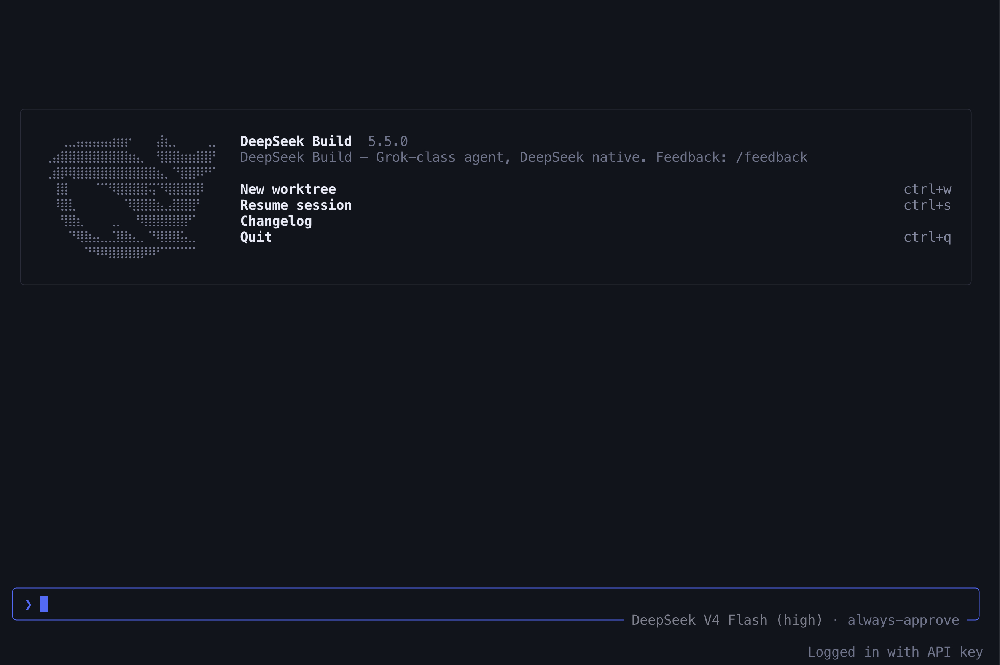

<div align="center">

**[English](README.md)** · [简体中文](README.zh-CN.md) · [日本語](README.ja-JP.md) · [한국어](README.ko-KR.md)

<!-- Temporary hero source: deepseek-ai/DeepSeek-V2 figures/logo.svg, as used by DeepSeek-V3. -->
<a href="https://github.com/deepseek-ai/DeepSeek-V3">
  
</a>

<h1>DeepSeek Build</h1>

<p><strong>DeepSeek-native coding. Grok-class execution.</strong></p>

<p>
  A full-screen terminal coding agent with safe edits, cache-aware sessions,
  and parallel execution built around DeepSeek models.
</p>

<p>
  <a href="https://github.com/innocarpe/deepseek-build/releases"></a>
  <a href="https://www.npmjs.com/package/@innocarpe/deepseek-build"></a>
  <a href="LICENSE"></a>
</p>

<p>
  <a href="#quick-start">Quick start</a> ·
  <a href="#why-deepseek-build">Why DeepSeek Build</a> ·
  <a href="#how-it-works">How it works</a> ·
  <a href="#deepseek-harness">DeepSeek Harness</a> ·
  <a href="#documentation">Documentation</a> ·
  <a href="#contributing">Contributing</a>
</p>

</div>

<p align="center">
  
</p>

## Quick start

Install from npm, add your DeepSeek API key, and open the TUI.

npm 12.0.0 and newer block dependency install scripts unless you opt in.
Without the flag below, npm reports success and does not install the agent.
npm 11 and older install with or without the flag.

```bash
npm install -g --allow-scripts=@innocarpe/deepseek-build @innocarpe/deepseek-build
deepseek-build setup
deepseek-build
```

Allow the package once for later global installs, then the plain command works:

```bash
npm config set allow-scripts=@innocarpe/deepseek-build --location=user
npm install -g @innocarpe/deepseek-build
```

The registry install requires Node.js 18 or newer and uses a prebuilt binary
when a matching release asset is available. It does not require Rust on that
path; see the [npm installation guide](docs/user-guide/05-npm.md) for platform
and source-fallback details.

`deepseek-build` is the primary command. `dsb` is the fully supported short
alias with the same behavior and full Semantic Version:

```bash
deepseek-build --version
dsb --version
```

If the installer reports that the product bin directory is not on `PATH`, add
it before launching:

```bash
export PATH="$HOME/.deepseek-build/bin:$PATH"
```

## Why DeepSeek Build

| Capability | What it means |
| --- | --- |
| **DeepSeek-native** | DeepSeek API defaults, Flash/Pro routing, reasoning effort, and a DeepSeek-branded TUI. |
| **Safe edits** | Version-bound snippet editing and fail-closed workspace permissions instead of silent whole-file replacement. |
| **Long-session economics** | Session changes append after the cached history instead of rewriting it. A cache miss names the assembled document that moved, the session logs its cumulative cache total, and a request that diverges from the session log fails the turn. |
| **Wall-clock throughput** | Parallel tools, background shell jobs, subagents, and opt-in worktrees run beneath the safety and cache layers. |
| **Durable sessions** | Resume the most recent full-screen session or address a saved session directly. |

The result is a coding agent that keeps the speed of a Grok-derived execution
engine while making DeepSeek-specific cost, edit, and permission rules part of
the product path.

## Everyday use

```bash
# Open the full-screen TUI
deepseek-build

# Resume the most recent TUI session
deepseek-build --resume

# Run one non-interactive turn
deepseek-build run "Explain the architecture of this repository."

# Use the trusted local coding profile
deepseek-build --dogfood
```

`--dogfood` allows writes inside the current workspace and enables shell
execution under policy. Writes and deletes outside the workspace remain denied.

For the short command, replace `deepseek-build` with `dsb` in any example.

At or below 60 columns, a submitted prompt folds to at most two rows and drops
the decorative `❯` and blank pad rows; wider windows keep the three-line
budget. On that phone-width pane the balance, cache hit, model and permission
share one row under the input box — cost and cache on the left, model and
permission on the right. Wider panes keep the model on the box border and the
balance on its own row. The full-screen view has a configurable status line at the bottom. On
the official DeepSeek API, DeepSeek V4.1 Flash (`deepseek-flash`) accepts
attached images directly, and text-only models keep images off the wire with
the on-disk fallback.

## Authentication and configuration

Interactive setup asks how to reach the DeepSeek models — the DeepSeek API or
OpenRouter — then stores that provider's API key in
`~/.deepseek-build/credentials.json` with mode `0600`:

```bash
deepseek-build setup
deepseek-build setup --provider openrouter --api-key "$KEY"   # non-interactive
deepseek-build auth status
deepseek-build auth logout
```

For CI or another non-interactive environment, set `DEEPSEEK_API_KEY`; the
environment variable takes precedence over a DeepSeek credentials file.
Line mode (`run` / `chat`) uses the DeepSeek API only. Product
configuration, credentials, sessions, and user skills live under
`~/.deepseek-build/` by default.

## Build from source

Source installation is intended for contributors and unsupported release
platforms. It requires Rust 1.94 or newer plus `protoc` or DotSlash; the first
agent build can take several minutes.

```bash
git clone https://github.com/innocarpe/deepseek-build.git
cd deepseek-build
./scripts/install.sh

deepseek-build --version
dsb --version
```

`npm install` in this checkout does not install `deepseek-build` or `dsb`.
It does not download a prebuilt and it does not compile. Use
`./scripts/install.sh` here, or
`npm install -g --allow-scripts=@innocarpe/deepseek-build @innocarpe/deepseek-build`
for the registry package. npm 12 does not install the agent without that flag.

See the [installation guide](docs/user-guide/01-install.md) for Cargo and custom
prefix options.

## How it works

```text
deepseek-build | dsb
        │
        ▼
product launcher ── auth · config · model routing
        │
        ▼
deepseek-build-agent ── full-screen TUI · tools · sessions
        │
        ▼
DeepSeek API
```

Three layers have explicit ownership. Higher-throughput machinery cannot bypass
the edit, permission, or cache contracts beneath it.

| Layer | Source | Owns |
| --- | --- | --- |
| **L1** | [Deep Code CLI](https://github.com/lessweb/deepcode-cli) | Snippet-safe edits, skills as context, and side-effect permissions. |
| **L2** | [Reasonix](https://github.com/esengine/DeepSeek-Reasonix) | Stable-prefix economics, Flash/Pro behavior, and tool-call repair. |
| **L3** | [Grok Build](https://github.com/xai-org/grok-build) | The base runtime, TUI, parallel tools, subagents, background work, and worktrees. |

Reading DeepSeek's official harness added no layer to this map: the append
rule and the request-versus-log check came from that evidence, described in
the next section.

The normative conflict rules live in the
[harness philosophy](docs/architecture/HARNESS_PHILOSOPHY.md), with the complete
system map in [SYSTEM_ARCHITECTURE.md](docs/architecture/SYSTEM_ARCHITECTURE.md).

## DeepSeek Harness

[dsh](https://github.com/deepseek-ai/deepseek-harness) is DeepSeek's official
open-source harness. It is not this product's architecture, and it is not a
fourth layer: DeepSeek Build stays a Rust full-screen TUI, with edits owned by
Deep Code, the cache contract owned by Reasonix, and execution owned by Grok
Build. dsh is evidence for how one family behaves — a cached prefix survives a
session change, and a request that does not match the session log is not sent.

| What changes in a session | What the product does |
| --- | --- |
| A later change of the stable system body | Earlier system messages stay byte-for-byte; the new body is appended after them. The model treats the most recent system message as the current body. |
| tools, skills, environment, or project instructions inside that body | The same append. The wire `tools` array is the full list on every request. There is no tool add/remove history message; Chat Completions has no field for one. |
| A cache miss | The turn names which assembled document moved, as `prefix_change=`. When the epoch moved and every document hash matches, it says `unattributed` instead of inventing a cause. |
| The session's cache | Once any response carried cache fields, every turn logs one `cache_session=` line. Hits and misses are token sums; a response without cache fields is `unreported` and is not counted as a miss. `deepseek-build run` and the REPL store the totals with the session, so a resume continues them. The full-screen status chip stays the last turn's ratio, the full-screen counter is not written to the session file, and a new process starts it at zero. |
| A request that diverges from the log | The turn fails before sampling. An item that cannot be serialized fails closed too. |
| deny | A later allow does not replace a deny. |

Deliberately not taken: a plugin host, agent teams, sandbox escalation,
request-series bookkeeping (`initial` / `resume` / `change`), and the
Anthropic Messages transport — this product speaks DeepSeek Chat Completions
([ADR 0005](docs/adr/0005-deepseek-provider-contract.md)).

Already present, so not ported again: spill of an oversized tool result (head,
tail, and a path to the rest), compaction aligned to the warm prefix, and a
snippet staleness guard stricter than dsh's path-scoped token. These are not
new features taken from dsh.

Read more: [dsh research note](docs/research/dsh-deepseek-harness.md) ·
[what this work changed](docs/product/CHANGELIST_6_1_0.md) ·
[design sources](docs/product/SOURCES.md).

## Documentation

| Start here | Use it for |
| --- | --- |
| [User guide](docs/user-guide/README.md) | Installation, setup, daily use, and the complete feature index. |
| [First-run setup](docs/user-guide/00-setup.md) | API keys, credential precedence, and headless setup. |
| [Sessions](docs/user-guide/03-sessions.md) | Full-screen resume and line-mode session storage. |
| [Permissions](docs/user-guide/08-permissions.md) | Interactive asks, headless denial, and workspace boundaries. |
| [Subagents](docs/user-guide/11-subagents.md) · [background tasks](docs/user-guide/12-background-tasks.md) · [worktrees](docs/user-guide/13-worktrees.md) | L3 execution surfaces. |
| [Known limitations](docs/product/KNOWN_LIMITS.md) | Current packaging, live-smoke, and platform boundaries. |
| [Product SSOT](docs/product/SSOT.md) | Which artifact wins when product documents disagree. |

## Development

```bash
cargo build -p dsb-cli
cargo test --workspace
./scripts/check-semver.sh
./scripts/test-owner-bar.sh
```

The root Rust workspace covers the product crates. Avoid vendor-full Cargo runs
for everyday checks; the owner-bar scripts use the bounded product path.

For the crate map, see [crates/README.md](crates/README.md). For the repository
map and documentation ownership, start at [docs/README.md](docs/README.md).

## Contributing

Read [CONTRIBUTING.md](CONTRIBUTING.md) before making changes. All meaningful
work lands through a focused PR with an atomic Conventional Commit, an existing
kind label, honest test evidence, and the review narrative defined in the
[PR authoring guide](docs/contributing/pr-body-standard.md).

## License

DeepSeek Build is available under the [Apache License 2.0](LICENSE). Vendored
and third-party code retains its original licensing; see [NOTICE](NOTICE).
