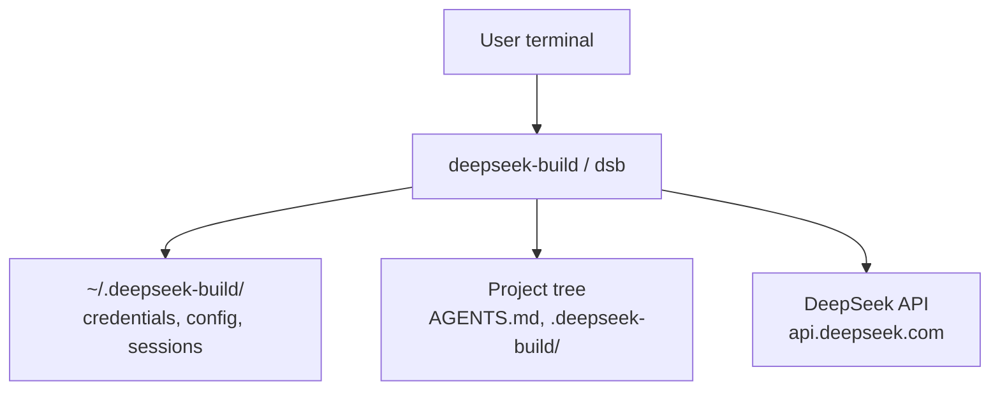
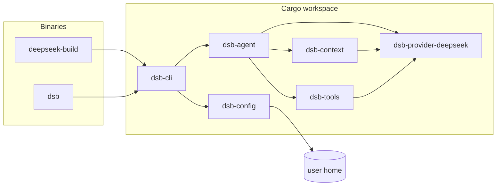
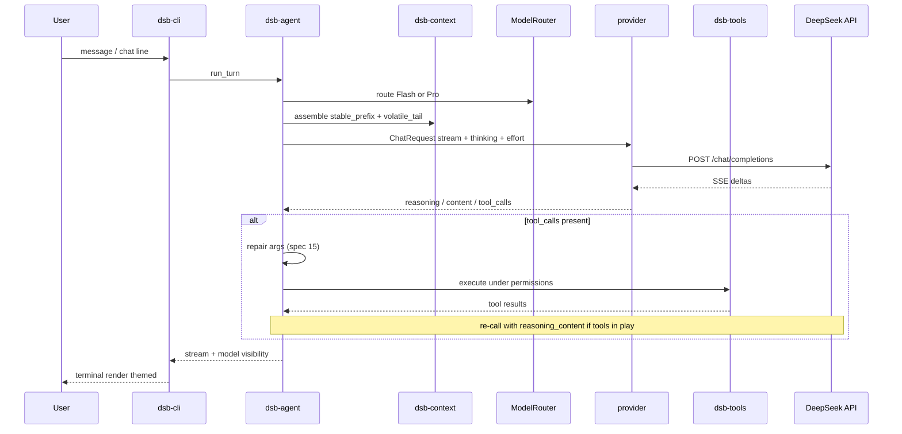
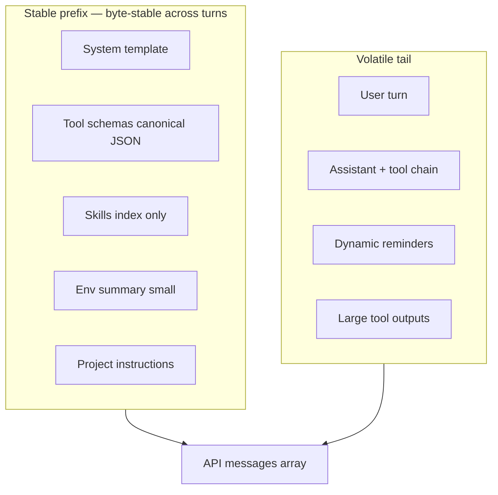
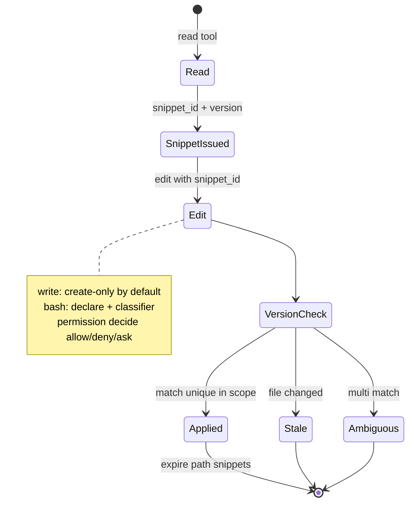
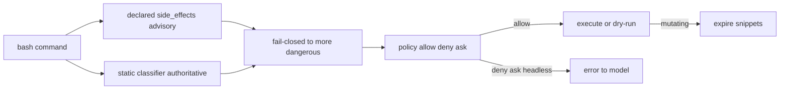
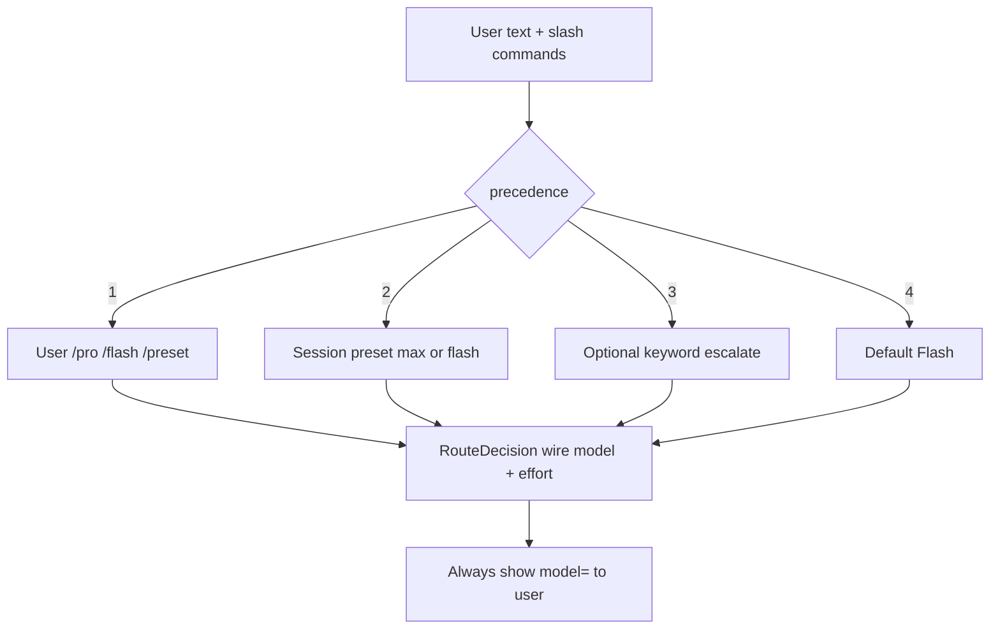
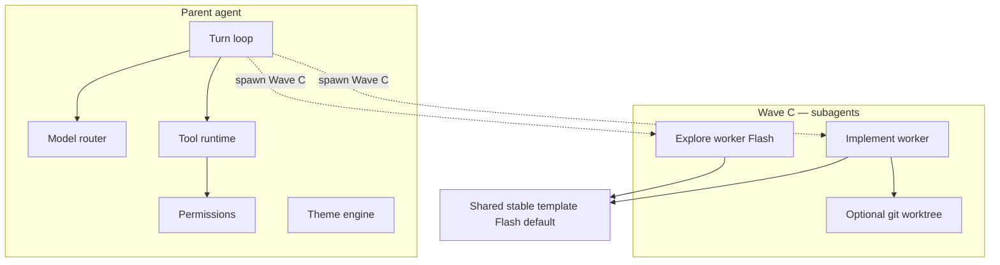
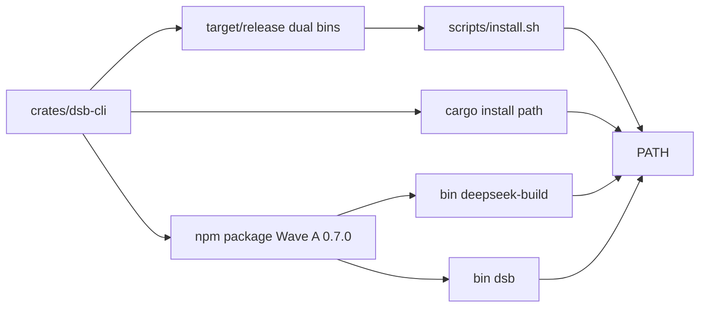

# System architecture — DeepSeek Build

**Status:** Living design (implementation may lag; specs + ADRs win on conflict)  
**Spine:** [HARNESS_PHILOSOPHY.md](./HARNESS_PHILOSOPHY.md)  
**Roadmap:** [MASTER_PLAN.md](../product/MASTER_PLAN.md)

---

## 1. One-paragraph overview

DeepSeek Build is a **local-first CLI agent**. The user invokes **`deepseek-build`** or **`dsb`**. The process loads config and credentials, builds a **cache-stable message prefix** plus a **volatile turn tail**, calls **DeepSeek Chat Completions** (Flash by default, Pro on escalate), optionally runs **tools** under **snippet** and **permission** rules, and streams **reasoning** and **content** separately to the terminal (themeable UI).

---

## 2. Context diagram

---

## 3. Process / crate architecture

| Crate | Responsibility |
|-------|----------------|
| `dsb-cli` | argv, REPL, install surface, theme I/O later |
| `dsb-config` | `DEEPSEEK_API_KEY`, credentials file, home root |
| `dsb-provider-deepseek` | HTTP/SSE, models, thinking wire, usage/cache |
| `dsb-context` | Stable prefix builder, epochs, project instructions |
| `dsb-agent` | Turn loop, routing, repair, tool dispatch |
| `dsb-tools` | Snippets (45), permissions (90), read/edit/write/bash/search… |

---

## 4. Request pipeline (single turn)

---

## 5. Cache contract (L2)

- Epoch = SHA-256 of stable prefix bytes (`dsb-context`).  
- Tool schema / skills index change → new epoch (expected).  
- Snippet table is **session state**, **not** in stable prefix.

---

## 6. Tools + permissions + snippets (L1)

---

## 7. Model routing (L2)

Wire IDs: `deepseek-v4-flash`, `deepseek-v4-pro` (ADR 0005).

---

## 8. Target architecture (Waves B–C) — not all built yet

**Worker cache law:** children reuse stable prefix templates; no unique cold system dumps; Flash-default workers.

---

## 9. Packaging (Waves A / D)

Version: single SemVer in workspace (+ npm match when published).

---

## 10. Trust boundaries

| Boundary | Rule |
|----------|------|
| Secrets | Env or `~/.deepseek-build/credentials.json` mode 0600; never project tree |
| Workspace vs out-of-cwd | Path scopes; default deny write/delete outside |
| Shell | Classifier authoritative; unknown → ask/deny |
| Model output | Never execute unparsed tool args; repair once then error |
| Theme | UX only; no security boundary |

---

## 11. Open design items

| Topic | Track |
|-------|--------|
| TUI stack (ratatui vs rich ANSI CLI) | Wave B theme |
| Session store schema JSONL | Wave A `0.5.0` |
| Parallel tool scheduler | Wave C / spec 50 |
| Subagent IPC | Wave C / spec 60 |
| Prebuilt multi-platform npm optionalDeps | post-`0.7.0` / ADR after 0007 source-assisted strategy |

---

## 12. Heart 3.x (Path A vs Path B)

2.x ships the **Grok-derived full-screen agent** as the default `dsb` entry (Path A).  
Thin crates (`dsb-agent` / `dsb-tools` / `dsb-context`) still own the **reference** Spec 45/90/10/15/20 implementations (Path B) but are **not** the default TUI tool path.

**Normative binding for 3.0.0:** [HEART_3X_SPEC_BINDING.md](./HEART_3X_SPEC_BINDING.md)  
**P0 red→green cases:** [HEART_3X_P0_TEST_PLAN.md](../product/HEART_3X_P0_TEST_PLAN.md)

Until Path A enforces L1/L2 hearts, do not claim heart fusion complete ([PRD-v3.md](../product/PRD-v3.md)).

---

## 13. References

- ADR 0004 toolchain · 0005 provider · 0006 CLI names + SemVer  
- Specs 10, 15, 20, 30, 45, 90 (+ 40/50/60/70/80 later)  
- Heart 3.x binding · test plan (links above)  
