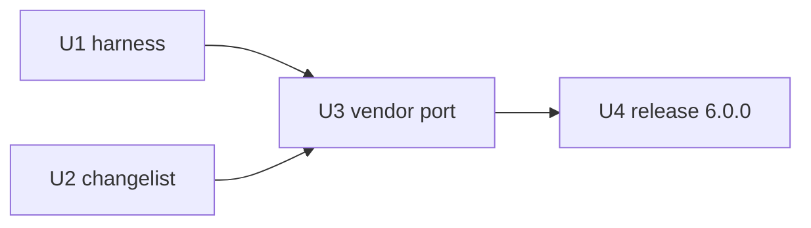

# Grok Build port train — `6.0.0`

| Field | Value |
|---|---|
| **Plan id** | `grok-port-6x` |
| **SemVer path** | **`6.0.0`** (single cut; the port is one base move) |
| **Depends on** | `5.6.0` on `main` (done) |
| **North star** | [VISION.md](./VISION.md) + [HARNESS_PHILOSOPHY.md](../architecture/HARNESS_PHILOSOPHY.md) |
| **PR planning** | [ULTRAGOAL_PR_PLANNING.md](./ULTRAGOAL_PR_PLANNING.md) |
| **Owner-readable outcome** | [CHANGELIST_6_0_0.md](./CHANGELIST_6_0_0.md) |
| **Sync procedure** | [skills/grok-sync](../../skills/grok-sync/SKILL.md) · [runbook](../contributing/grok-sync-runbook.md) · [ledger](./UPSTREAM_SYNC_LEDGER.md) |
| **Child runtime** | **Grok only** (parent = Grok Build `1.0.41`) |

---

## 0. The problem this train solves

The product's base is vendored Grok Build, pinned at `1.0.0` (2026-08-09) while
upstream reached `1.0.41` (2026-09-22). Measured gap: **41 releases**, 25 sync
commits, 3,587 files, +750,612 / −383,434, **472 changelog bullets**, workspace
crates 81 → 102.

Two things follow. The product is missing a large body of upstream latency work,
bug fixes and TUI polish. And the way it fell behind is itself the defect: the
refresh procedure was one runbook paragraph plus a patch script, which **no
longer works** — measured against `1.0.41`, **0 of 13** carried patches apply.

---

## 1. Units

### U1 — `docs(harness): grok-sync skill, runbook, ledger, inventory script`

| Field | Value |
|---|---|
| **Intent** | Make syncing a procedure with tooling, so the next instruction to "sync latest grok build" is not a rediscovery. |
| **Touches** | `skills/grok-sync/`, `docs/contributing/grok-sync-runbook.md`, `docs/product/UPSTREAM_SYNC_LEDGER.md`, `scripts/grok-sync-inventory.sh`, `docs/architecture/GROK_VENDOR.md` |
| **Depends on** | none |
| **Parallel with** | U2 (disjoint trees, no build) |
| **SemVer** | none |
| **Tests** | `./scripts/grok-sync-inventory.sh` against real upstream; `./scripts/check-semver.sh` |

### U2 — `docs(product): the 6.0.0 story in one file`

| Field | Value |
|---|---|
| **Intent** | The owner reads one file and knows what the next major improves, fixes, changes and refuses. |
| **Touches** | `docs/product/CHANGELIST_6_0_0.md`, `docs/product/PRD-v6.md`, `docs/product/GROK_1_0_41_PORT_GOALS.md`, `docs/product/versions/README.md`, `CHANGELOG.md` |
| **Depends on** | none |
| **Parallel with** | U1 |
| **SemVer** | none |
| **Tests** | `./scripts/reorder-changelog.sh --check` |

### U3 — `chore(vendor): refresh grok-build 1.0.0 → 1.0.41`

| Field | Value |
|---|---|
| **Intent** | Move the base and re-derive this product's overlay on top of it, without losing anything the overlay carries. |
| **Touches** | `third_party/grok-build/`, `SOURCE_REV`, `patches/grok-build/`, `docs/research/grok-build.md`, `docs/architecture/GROK_VENDOR.md`, `crates/` where overlay surfaces meet |
| **Depends on** | U1 (the procedure), U2 (the verdicts are the changelist's input) |
| **Parallel with** | **nothing that builds** — vendored builds are serial across all worktrees |
| **SemVer** | none (the release unit bumps) |
| **Tests** | `build-grok-pager.sh check`; `test-owner-bar.sh`; `check-path-a-linkage.sh`; `test-heart-regression.sh`; `test-grok-vendor-offline.sh`; `test-product-offline.sh` |

**Method: three-way merge.** Base = upstream `1.0.0`; ours = the vendored tree;
theirs = upstream `1.0.41`. A raw `rsync --delete` plus patch re-apply cannot
work here and would silently drop the overlay.

### U4 — `chore(release): 6.0.0`

| Field | Value |
|---|---|
| **Intent** | Cut, tag, publish, verify — and carry the changelist digest into the GitHub release notes. |
| **Depends on** | U3 verified green |
| **SemVer** | **`6.0.0`** (the line's only bump) |
| **Tests** | [release skill](../../skills/release/SKILL.md) post-publish checklist |

---

## 2. Sequencing

**Sequential:** U3 → U4 (a publish without the port would be dishonest).
**Parallel:** U1 ∥ U2 — disjoint trees, neither builds.
**Serial resource:** vendored Grok builds, across every worktree.

---

## 3. Gate ledger

| Gate | Required | Status |
|---|---|---|
| Vendor check | `build-grok-pager.sh check` exits 0 | |
| Owner bar | `test-owner-bar.sh` green | |
| Path A linkage | `check-path-a-linkage.sh` green | |
| Heart regression | `test-heart-regression.sh` green | |
| Vendor offline | `test-grok-vendor-offline.sh` green | |
| Product offline | `test-product-offline.sh` green | |
| SemVer | `check-semver.sh` green | |
| Publish | global install verified, tag asset attached | |

Update [GATES.md](../GATES.md) in the same PR as any flip; a gate that did not
run is not green.

---

## 4. Exit criteria

1. Vendored tree at `1.0.41` with the overlay intact and the gates green.
2. [CHANGELIST_6_0_0.md](./CHANGELIST_6_0_0.md) merged and readable.
3. Sync infrastructure merged; one command reports where the pin stands.
4. `v6.0.0` tagged, published, verified; release notes carry the digest.
