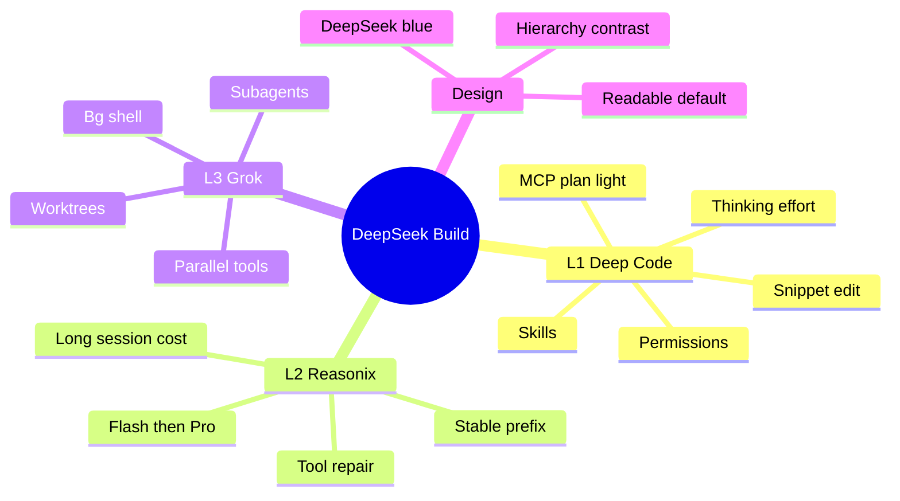
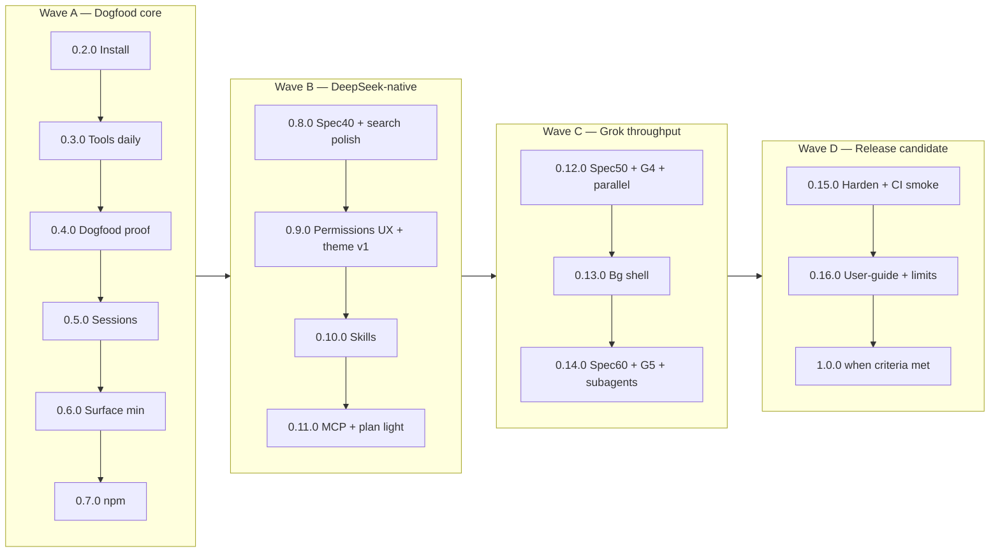
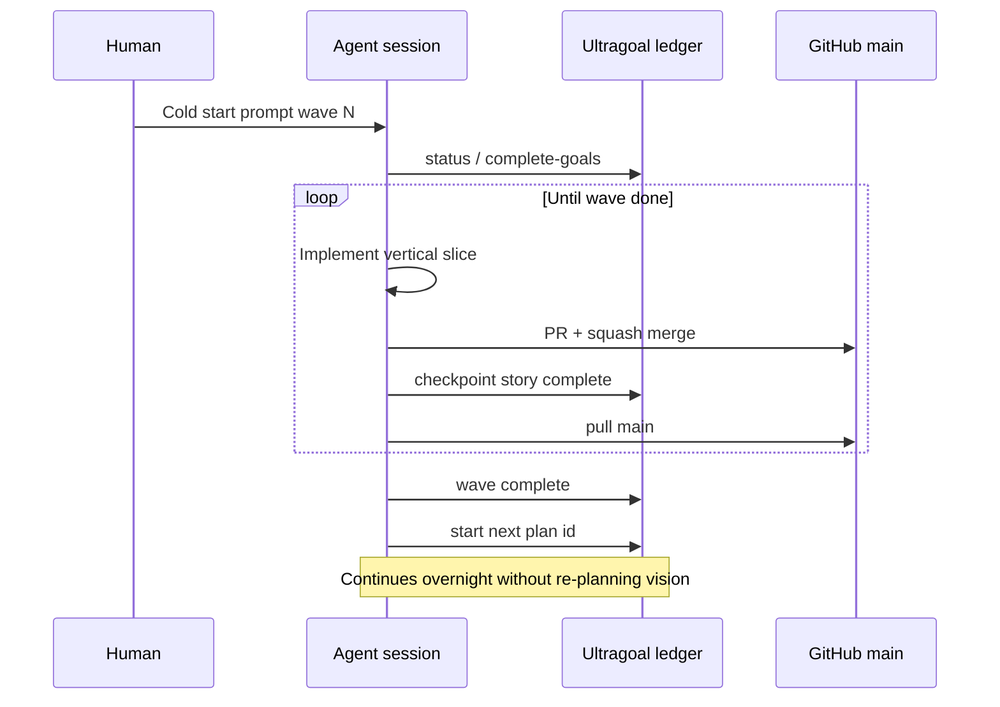

# Master plan — final goal to overnight execution

**Status:** Normative product roadmap (living)  
**Audience:** Humans + autonomous agents running multi-day ultragoal trains  
**Last updated:** 2026-08-06  
**SemVer rule:** Always full `MAJOR.MINOR.PATCH` — never bare `1.0`  
**CLI:** `deepseek-build` (primary) · `dsb` (alias)

This is the **one board**. Other docs plug into it; they do not replace it.

| Doc | Role |
|-----|------|
| **This file** | Final goal + staged goals + SemVer waves + ultragoal chain |
| [VISION.md](./VISION.md) | One-liner and pillars |
| [PRD-v1.md](./PRD-v1.md) | Problem / goals (overall) |
| [prd/](./prd/) | **Staged PRDs** per maturity wave |
| [RELEASE_TRAIN_0x.md](./RELEASE_TRAIN_0x.md) | Wave A detail (`0.2.0`–`0.7.0` dogfood) |
| [MILESTONES.md](./MILESTONES.md) | M0–M6 feature themes |
| [GATES.md](../GATES.md) | Spec readiness gates G0–G6 |
| [SYSTEM_ARCHITECTURE.md](../architecture/SYSTEM_ARCHITECTURE.md) | Runtime design + mermaid |
| [HARNESS_PHILOSOPHY.md](../architecture/HARNESS_PHILOSOPHY.md) | L1/L2/L3 conflict rules |
| [ULTRAGOAL_CHAIN.md](./ULTRAGOAL_CHAIN.md) | How to chain plans overnight |
| [ULTRAGOAL_PR_PLANNING.md](./ULTRAGOAL_PR_PLANNING.md) | **Mandatory:** PR units, parallel/sequential DAG, atomic commits, stacking |

---

## 1. Final goal (unchanged)

Build **DeepSeek Build**: a terminal coding agent that is simultaneously:

1. **DeepSeek-native (Deep Code / L1)** — snippet edit, side-effect permissions, skills-as-context, thinking/effort, session surface; not a generic multi-vendor zoo.  
2. **Cache- and cost-disciplined (Reasonix / L2)** — byte-stable prefix, Flash-first / Pro escalate, tool-call repair, long sessions stay affordable.  
3. **Grok-class throughput (Grok / L3)** — parallel tools, background shell, subagents, optional worktrees — **without** breaking L1/L2 (worker cache law).  
4. **Readable by default (product design)** — **DeepSeek blue** accent theme; default UI must **not** be Grok-style near-black monochrome low contrast.

**Success feeling:** *I type `deepseek-build` (or `dsb`), work on a real repo for hours, progress is fast, cost is sane, edits are safe, and the screen is easy to read.*

**`1.0.0` meaning (only when earned):** install is boring, dogfood is sustained, L1+L2+L3+theme defaults are shippable, known limits documented. Until then: stay on **`0.y.z`**.



---

## 2. Where we are (facts)

| Item | Value |
|------|--------|
| Version on `main` | Read `Cargo.toml` (expect **`0.3.0`+** while Wave A runs) |
| Active ultragoal | **`dogfood-0x`** (Wave A) — then auto-chain to `native-0x` |
| Gates green | **G0–G3** |
| Gates red | **G4–G6** (parallel / subagents / skills-MCP-sessions specs readiness) |

Do **not** assume chat memory. Re-read `Cargo.toml` version and `omc ultragoal status --plan-id dogfood-0x`.

---

## 3. Stage map (waves)

Waves are **ordered**. A later wave may draft specs early, but must not ship gated runtime without green gates.



| Wave | Plan id | SemVer band | Staged PRD | Outcome |
|------|---------|-------------|------------|---------|
| **A Dogfood** | `dogfood-0x` | **`0.2.0`–`0.7.0`** | [PRD-wave-A-dogfood.md](./prd/PRD-wave-A-dogfood.md) | Install + single-agent coding daily |
| **B Native** | `native-0x` | **`0.8.0`–`0.11.0`** | [PRD-wave-B-native.md](./prd/PRD-wave-B-native.md) | Deep Code–class surface + **DeepSeek blue** default |
| **C Throughput** | `throughput-0x` | **`0.12.0`–`0.14.0`** | [PRD-wave-C-throughput.md](./prd/PRD-wave-C-throughput.md) | Grok-class parallel + subagents under L1/L2 |
| **D RC** | `rc-1.0.0` | **`0.15.0`–`1.0.0`** | [PRD-wave-D-rc.md](./prd/PRD-wave-D-rc.md) | Boring install, docs, then **`1.0.0`** |

Detail for Wave A minors: [RELEASE_TRAIN_0x.md](./RELEASE_TRAIN_0x.md).

---

## 4. Stage goals (checklist form)

### Wave A — Dogfood core (`dogfood-0x`)

- [x] **`0.2.0`** PATH install (`deepseek-build` + `dsb`)  
- [x] **`0.3.0`** grep/search, bash execute under policy, workspace-write profile (`--dogfood`) — if on `main`  
- [ ] **`0.4.0`** real dogfood on this repo  
- [ ] **`0.5.0`** session persist/resume  
- [ ] **`0.6.0`** skills index min + model/effort UX  
- [ ] **`0.7.0`** npm both bins, SemVer match  

**Exit:** dogfood-usable (§ RELEASE_TRAIN_0x §3). Still **`0.x`**.

### Wave B — DeepSeek-native (`native-0x`)

- [ ] Spec **40** ready-for-impl (tool surface)  
- [ ] Interactive permission ask + saved allow  
- [ ] **Theme v1: DeepSeek blue**, readable default (not Grok-black)  
- [ ] Spec **70** skills product  
- [ ] Spec **80** MCP with cache epoch rules  
- [ ] Spec **110** light plan (non-blocking)  
- [ ] Ship minors **`0.8.0`–`0.11.0`** as scoped PRs  

**Exit:** “I work all day in DeepSeek Build without missing Deep Code essentials.”

### Wave C — Grok throughput (`throughput-0x`)

- [ ] Spec **50** + **G4 green**  
- [ ] Parallel independent tools + cancel/partial failure  
- [ ] Background shell + collect  
- [ ] Spec **60** + **G5 green**  
- [ ] Subagents + worker cache law + optional worktree  
- [ ] Ship **`0.12.0`–`0.14.0`**  

**Exit:** wall-clock progress comparable to Grok-class tools on multi-step tasks, without cache collapse.

### Wave D — RC → **`1.0.0`** (`rc-1.0.0`)

- [ ] CI build/test smoke (product, not process-police)  
- [ ] user-guide complete for shipped commands  
- [ ] CHANGELOG + known-limits  
- [ ] Sustained dogfood evidence  
- [ ] Tag **`1.0.0`** only when checklist in [PRD-wave-D-rc.md](./prd/PRD-wave-D-rc.md) is green  

---

## 5. Design track (DeepSeek blue) — first-class

Runs **in parallel** from Wave A late / Wave B early; must not wait for subagents.

| Requirement | Notes |
|-------------|--------|
| Default theme optimizes **readability** | Contrast, hierarchy, code blocks |
| Brand accent **DeepSeek blue** | Document hex/ANSI tokens in theme spec |
| Default ≠ Grok near-black monochrome | Dark optional; default is legible |
| Role colors | content / reasoning / tool / model line / error |
| Evidence | terminal captures in PR bodies |

Theme tokens live under `docs/product/DESIGN.md` (or theme section in architecture) when first implementation PR lands; until then this section is normative intent.

---

## 6. Overnight / continuous execution contract

1. **One wave plan active at a time** in the agent session (finish or hand off cleanly).  
2. When `dogfood-0x` hits all complete → **immediately** `omc ultragoal complete-goals --plan-id native-0x` (create if missing per [ULTRAGOAL_CHAIN.md](./ULTRAGOAL_CHAIN.md)).  
3. Same for `native-0x` → `throughput-0x` → `rc-1.0.0`.  
4. Cold start: use wave-specific prompt under `docs/product/ULTRAGOAL_PROMPT_*.md`.  
5. Never invent **`1.0.0`** mid-wave; never skip G4 before parallel runtime.  
6. Child runtime = parent runtime (Grok→grok only unless user orders otherwise).  
7. **PR planning first (mandatory):** before code for any ultragoal story, write the **PR unit plan** — units, sequential vs parallel, atomic commits, stacking — per [ULTRAGOAL_PR_PLANNING.md](./ULTRAGOAL_PR_PLANNING.md). No plan → no implement.  
8. **Atomic commits** on feature branches; **squash-merge** to `main` still allowed.  
9. **Chaining/stacking PRs** for sequential work to minimize conflicts; parallel only on disjoint paths.



---

## 7. Anti-goals (still true)

From [NON_GOALS.md](./NON_GOALS.md): Gajae multi-stage team harness as identity; Grok hard-fork; YOLO-only permissions; free-form whole-file edit as primary; process-police CI as quality substitute.

---

## 8. Progress log (release train)

| SemVer | Wave | Date | Notes |
|--------|------|------|--------|
| `0.1.0` | — | 2026-08-06 | Engine + tools core source preview |
| `0.2.0` | A | 2026-08-06 | PATH install dual CLI (#18) |
| `0.3.0` | A | 2026-08-06 | Tools daily: grep + `--dogfood` |
| … | A–D | — | Update on each minor release PR |

---

## 9. Related entry points for a new agent

```bash
git pull origin main
cat docs/product/MASTER_PLAN.md          # this file
cat docs/architecture/SYSTEM_ARCHITECTURE.md
omc ultragoal status --plan-id dogfood-0x
# when dogfood-0x complete:
omc ultragoal status --plan-id native-0x
```
