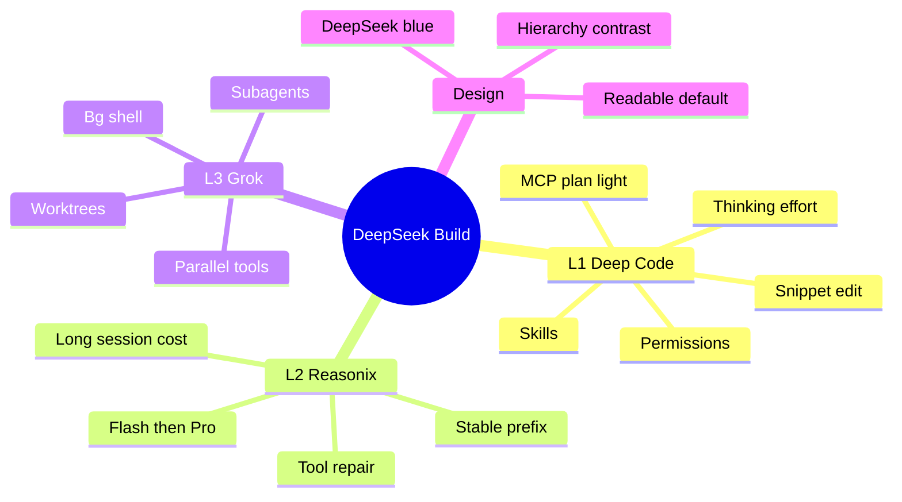
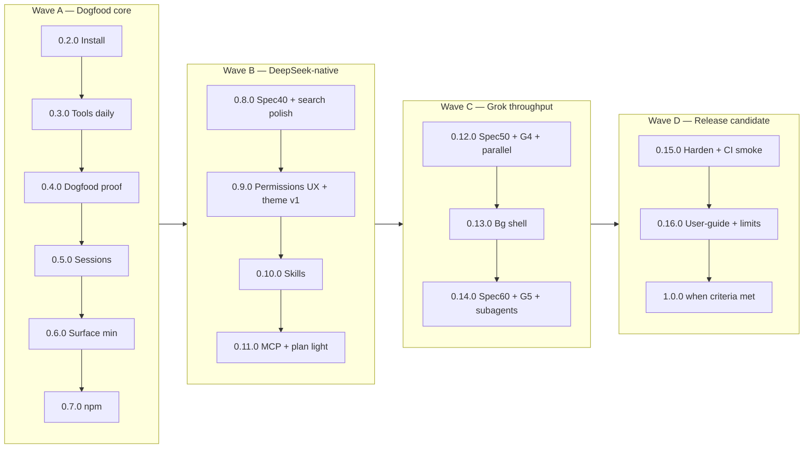
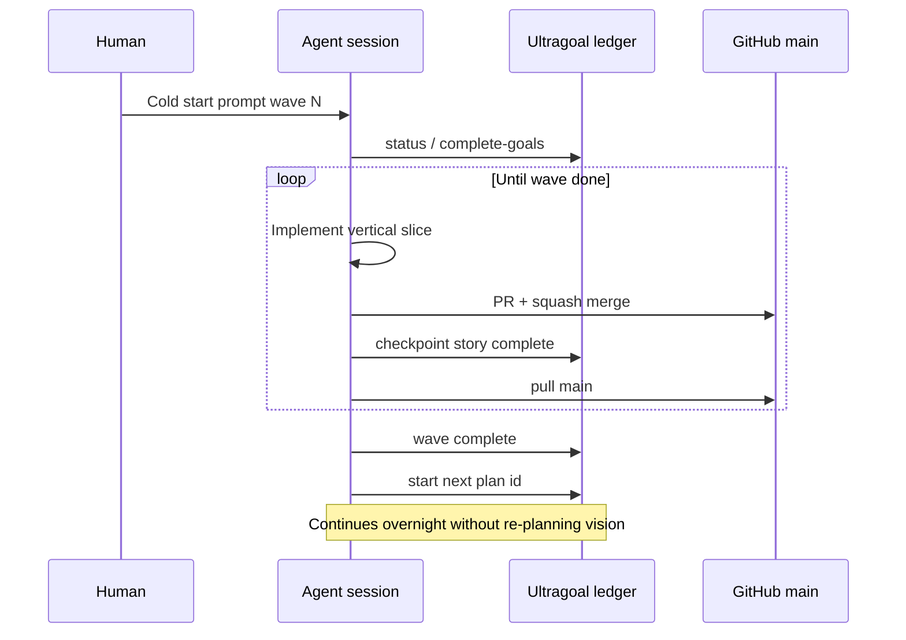

# Master plan — final goal to overnight execution

**Status:** Normative product roadmap (living) — **see replan**  
**Audience:** Humans + autonomous agents running multi-day ultragoal trains  
**Last updated:** 2026-08-06  
**SemVer rule:** Always full `MAJOR.MINOR.PATCH` — never bare `1.0`  
**CLI:** `deepseek-build` (primary) · `dsb` (alias)

> ## Product version lines (2026-08-07)
>
> | Line | PRD | Status |
> |------|-----|--------|
> | **1.x** | [PRD-v1.md](./PRD-v1.md) | Scaffold / legacy |
> | **2.x** | [PRD-v2.md](./PRD-v2.md) | **Shipped** Grok base + DeepSeek shell (`2.0.0`+) |
> | **3.x** | [PRD-v3.md](./PRD-v3.md) | **Next major** — L1/L2 heart fusion under Grok shell |
> | **4.x** | [PRD-v4.md](./PRD-v4.md) | Later — L3 productization |
>
> Index: **[versions/README.md](./versions/README.md)** · SSOT: **[SSOT.md](./SSOT.md)**  
> Historical replan that defined 2.0.0: **[REPLAN_2.0.md](./REPLAN_2.0.md)**  
>
> Waves A–D below remain **historical scaffold chronology**. Do not treat their
> “complete” checkboxes as “heart fusion done.”

This board still holds scaffold history. **Product SSOT for major targets is versions/ + PRD-vN.**

| Doc | Role |
|-----|------|
| **This file** | Final goal + staged goals + SemVer waves + ultragoal chain |
| [VISION.md](./VISION.md) | One-liner and pillars |
| [versions/README.md](./versions/README.md) | **Major line index** |
| [PRD-v1.md](./PRD-v1.md) · [PRD-v2.md](./PRD-v2.md) · [PRD-v3.md](./PRD-v3.md) · [PRD-v4.md](./PRD-v4.md) | Per-major PRDs |
| [prd/](./prd/) | Scaffold-era **wave** PRDs (historical) |
| [RELEASE_TRAIN_0x.md](./RELEASE_TRAIN_0x.md) | Wave A detail (`0.2.0`–`0.7.0` dogfood) |
| [MILESTONES.md](./MILESTONES.md) | M0–M6 feature themes |
| [GATES.md](../GATES.md) | Spec readiness gates G0–G6 |
| [SYSTEM_ARCHITECTURE.md](../architecture/SYSTEM_ARCHITECTURE.md) | Runtime design + mermaid |
| [HARNESS_PHILOSOPHY.md](../architecture/HARNESS_PHILOSOPHY.md) | L1/L2/L3 conflict rules |
| [ULTRAGOAL_CHAIN.md](./ULTRAGOAL_CHAIN.md) | How to chain plans overnight |
| [ULTRAGOAL_PR_PLANNING.md](./ULTRAGOAL_PR_PLANNING.md) | **Mandatory:** PR units, parallel/sequential DAG, atomic commits, stacking |
| [SSOT.md](./SSOT.md) | Conflict priority when docs disagree |
| [HEART_3X_GOALS.md](./HEART_3X_GOALS.md) | **Active product ultragoal board** G001–G008 → **3.0.0** |
| [WAVE_3x_PR_DAG.md](./WAVE_3x_PR_DAG.md) | **Active product** PR units (heart fusion) |
| [ULTRAGOAL_PROMPT_COLD_START_3.0.md](./ULTRAGOAL_PROMPT_COLD_START_3.0.md) | Cold-start paste for `heart-3x` |
| [PARALLEL_3X_4X_PLAN.md](./PARALLEL_3X_4X_PLAN.md) | **Parallel ops** through 4.0.0 (lanes A–D) |
| [WAVE_4x_PR_DAG.md](./WAVE_4x_PR_DAG.md) | 4.x PR units (draft until `v3.0.0`) |
| [FLEET_4X_GOALS.md](./FLEET_4X_GOALS.md) | Future ultragoal board `fleet-4x` → **4.0.0** |
| [GROKBASE_2X_GOALS.md](./GROKBASE_2X_GOALS.md) | **Completed** 2.x board G001–G012 → 2.0.0 |
| [WAVE_2x_PR_DAG.md](./WAVE_2x_PR_DAG.md) | **Completed** 2.x units W0–W4 (Grok base) |
| [WAVE_A_PR_DAG.md](./WAVE_A_PR_DAG.md) / [WAVE_B_PR_DAG.md](./WAVE_B_PR_DAG.md) | Historical scaffold unit DAGs |
| [stack-merge-runbook.md](../contributing/stack-merge-runbook.md) | Squash-stack repair + failure ladder |

---

## 1. Final goal (unchanged)

Build **DeepSeek Build**: a terminal coding agent that is simultaneously:

1. **DeepSeek-native (Deep Code / L1)** — snippet edit, side-effect permissions, skills-as-context, thinking/effort, session surface; not a generic multi-vendor zoo.  
2. **Cache- and cost-disciplined (Reasonix / L2)** — byte-stable prefix, Flash-first / Pro escalate, tool-call repair, long sessions stay affordable.  
3. **Grok-class throughput (Grok / L3)** — parallel tools, background shell, subagents, optional worktrees — **without** breaking L1/L2 (worker cache law).  
4. **Readable by default (product design)** — **DeepSeek blue** accent theme; default UI must **not** be Grok-style near-black monochrome low contrast.

**Success feeling:** *I type `deepseek-build` (or `dsb`), a Grok-class agent opens, I work on a real repo for hours, progress is fast, cost is sane, edits are safe, and the screen is easy to read.*

**Product SemVer (replan):** that success feeling is earned at **`2.0.0`** on a **Grok Build base** — see [REPLAN_2.0.md](./REPLAN_2.0.md).  
Published **`1.0.0` / `1.x`** = scaffold only (do not re-tag history).



---

## 2. Where we are (facts)

| Item | Value |
|------|--------|
| Version on `main` | Read `Cargo.toml` / npm — **`1.x` scaffold line** |
| Product direction | **[REPLAN_2.0.md](./REPLAN_2.0.md)** — target **`2.0.0`** Grok base |
| Active ultragoal | **`grokbase-2x`** (after replan merge) — not A–D |
| Scaffold A–D | Ledgers complete **as scaffold history**; not product DoD |
| Gates green | Scaffold gates G0–G5 / G6a–d may be green — *ledger green ≠ Grok-base product* |
| Honesty note | **`1.0.0` tagged early**; thin REPL ≠ Grok TUI — see KNOWN_LIMITS + REPLAN |

Do **not** assume chat memory. Re-read `Cargo.toml` version and [REPLAN_2.0.md](./REPLAN_2.0.md) / [WAVE_2x_PR_DAG.md](./WAVE_2x_PR_DAG.md).

---

## 3. Stage map (waves)

Waves are **ordered**. A later wave may draft specs early, but must not ship gated runtime without green gates.



| Wave | Plan id | SemVer band | Staged PRD | Outcome |
|------|---------|-------------|------------|---------|
| **A Dogfood** | `dogfood-0x` | **`0.2.0`–`0.7.0`** | [PRD-wave-A-dogfood.md](./prd/PRD-wave-A-dogfood.md) | Install + single-agent coding daily |
| **B Native** | `native-0x` | **`0.8.0`–`0.11.0`** | [PRD-wave-B-native.md](./prd/PRD-wave-B-native.md) | Deep Code–class surface + **DeepSeek blue** default |
| **C Throughput** | `throughput-0x` | **`0.12.0`–`0.14.0`** | [PRD-wave-C-throughput.md](./prd/PRD-wave-C-throughput.md) | Grok-class parallel + subagents under L1/L2 |
| **D RC** | `rc-1.0.0` | **`0.15.0`–`1.0.0`** | [PRD-wave-D-rc.md](./prd/PRD-wave-D-rc.md) | Boring install, docs, then **`1.0.0`** |

Detail for Wave A minors: [RELEASE_TRAIN_0x.md](./RELEASE_TRAIN_0x.md).

---

## 4. Stage goals (checklist form)

### Wave A — Dogfood core (`dogfood-0x`)

- [x] **`0.2.0`** PATH install  
- [x] **`0.3.0`** tools daily + `--dogfood`  
- [x] **`0.4.0`** dogfood proof  
- [x] **`0.5.0`** sessions (G6a)  
- [x] **`0.6.0`** skills index min + effort UX (G6b)  
- [x] **`0.7.0`** npm package dual bins (registry publish = human, ADR 0007)  

**Exit:** dogfood-usable via `./scripts/smoke-dogfood.sh`. Still **`0.x`**. **Next: Wave B.**

### Wave B — DeepSeek-native (`native-0x`)

- [x] Spec **40** ready-for-impl (tool surface) + ship **`0.8.0`**  
- [x] Interactive permission ask + saved allow  
- [x] **Theme v1: DeepSeek blue**, readable default (not Grok-black)  
- [x] Spec **70** skills product + ship **`0.10.0`**  
- [x] Spec **80** MCP with cache epoch rules  
- [x] Spec **110** light plan (non-blocking)  
- [x] Ship minors **`0.8.0`–`0.11.0`** (Wave B complete)  

**Exit:** “I work all day in DeepSeek Build without missing Deep Code essentials.”

### Wave C — Grok throughput (`throughput-0x`)

- [x] Spec **50** + **G4 green** + parallel tools (**0.12.0**)  
- [x] Parallel independent tools + cancel/partial failure  
- [x] Background shell + collect (**0.13.0**)  
- [x] Spec **60** + **G5 green**  
- [x] Subagents + worker cache law (in-process; worktree optional later)  
- [x] Ship **`0.12.0`–`0.14.0`** (Wave C complete)  

**Exit:** wall-clock progress comparable to Grok-class tools on multi-step tasks, without cache collapse.

### Wave D — RC → **`1.0.0`** (`rc-1.0.0`)

- [x] CI build/test smoke (product, not process-police) — **0.15.0**  
- [x] user-guide complete for shipped commands — **0.16.0**  
- [x] CHANGELOG + known-limits — **0.16.0**  
- [x] Sustained dogfood evidence — automated smoke + multi-wave overnight train (human multi-day still recommended)  
- [x] Tag **`1.0.0`** when checklist green  

---

## 5. Design track (DeepSeek blue) — first-class

Runs **in parallel** from Wave A late / Wave B early; must not wait for subagents.

| Requirement | Notes |
|-------------|--------|
| Default theme optimizes **readability** | Contrast, hierarchy, code blocks |
| Brand accent **DeepSeek blue** | Document hex/ANSI tokens in theme spec |
| Default ≠ Grok near-black monochrome | Dark optional; default is legible |
| Role colors | content / reasoning / tool / model line / error |
| Evidence | terminal captures in PR bodies |

Theme tokens live under `docs/product/DESIGN.md` (or theme section in architecture) when first implementation PR lands; until then this section is normative intent.

---

## 6. Overnight / continuous execution contract

1. **One wave plan active at a time** in the agent session (finish or hand off cleanly).  
2. When `dogfood-0x` hits all complete → **immediately** `omc ultragoal complete-goals --plan-id native-0x` (create if missing per [ULTRAGOAL_CHAIN.md](./ULTRAGOAL_CHAIN.md)).  
3. Same for `native-0x` → `throughput-0x` → `rc-1.0.0`.  
4. Cold start: use wave-specific prompt under `docs/product/ULTRAGOAL_PROMPT_*.md`.  
5. Never invent **`1.0.0`** mid-wave; never skip G4 before parallel runtime.  
6. Child runtime = parent runtime (Grok→grok only unless user orders otherwise).  
7. **PR planning first (mandatory):** before code for any ultragoal story, write the **PR unit plan** — units, sequential vs parallel, atomic commits, stacking — per [ULTRAGOAL_PR_PLANNING.md](./ULTRAGOAL_PR_PLANNING.md). No plan → no implement.  
8. **Atomic commits** on feature branches; **squash-merge** to `main` still allowed.  
9. **Chaining/stacking PRs** for sequential work to minimize conflicts; parallel only on disjoint paths.



---

## 7. Anti-goals (still true)

From [NON_GOALS.md](./NON_GOALS.md): Gajae multi-stage team harness as identity; Grok hard-fork; YOLO-only permissions; free-form whole-file edit as primary; process-police CI as quality substitute.

---

## 8. Progress log (release train)

| SemVer | Wave | Date | Notes |
|--------|------|------|--------|
| `0.1.0` | — | 2026-08-06 | Engine + tools core source preview |
| `0.2.0` | A | 2026-08-06 | PATH install dual CLI (#18) |
| `0.3.0` | A | 2026-08-06 | Tools daily: grep + `--dogfood` |
| `0.4.0`–`0.7.0` | A | 2026-08-06 | Dogfood proof, sessions, surface, npm package (#23–#26) |
| `0.7.1` | A | 2026-08-06 | Help SemVer example + npm install docs (#30) |
| `0.8.0` | B | 2026-08-06 | Spec 40 core tools surface + registry align (#31–#33) |
| `0.9.0` | B | 2026-08-06 | Permissions TTY grants + DeepSeek blue theme v1 (#34–#36) |
| `0.10.0` | B | 2026-08-06 | Skills product expand + list CLI (#37–#38) |
| `0.11.0` | B | 2026-08-06 | MCP + light plan; G6c/G6d green (#39–#40) |
| `0.12.0` | C | 2026-08-06 | Spec 50 + G4 parallel readonly tools (#41–#42) |
| `0.13.0` | C | 2026-08-06 | Background bash + bash_collect (#43–#44) |
| `0.14.0` | C | 2026-08-06 | Spec 60 + G5 subagents/cache law (#45–#46) |
| `0.15.0` | D | 2026-08-06 | Product CI smoke workflow (#47–#48) |
| `0.16.0` | D | 2026-08-06 | user-guide + KNOWN_LIMITS + CHANGELOG (#49–#50) |
| `1.0.0` | D | 2026-08-06 | First stable release; tag v1.0.0 |
| … | B–D | — | Update on each minor release PR |

---

## 9. Related entry points for a new agent

```bash
git pull origin main
cat docs/product/MASTER_PLAN.md          # this file
cat docs/architecture/SYSTEM_ARCHITECTURE.md
omc ultragoal status --plan-id dogfood-0x
# when dogfood-0x complete:
omc ultragoal status --plan-id native-0x
```
