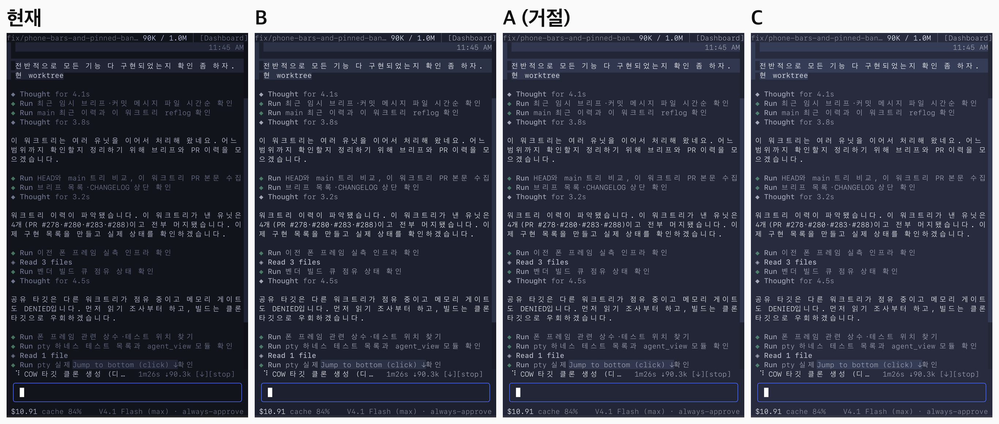
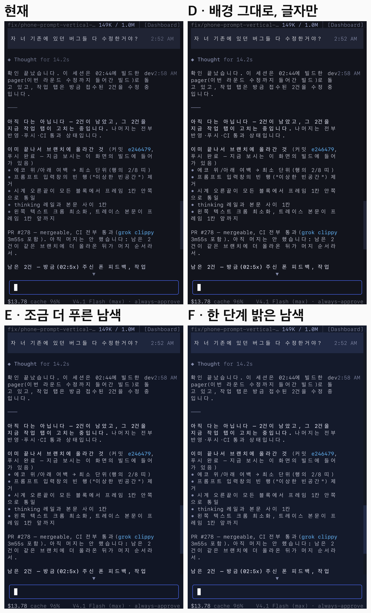
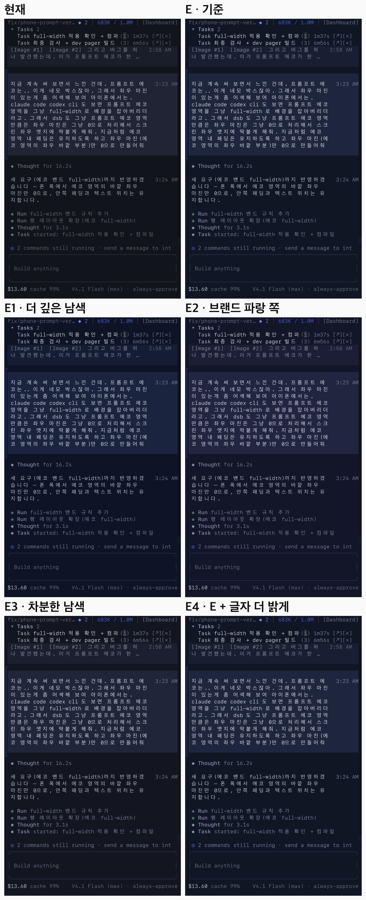
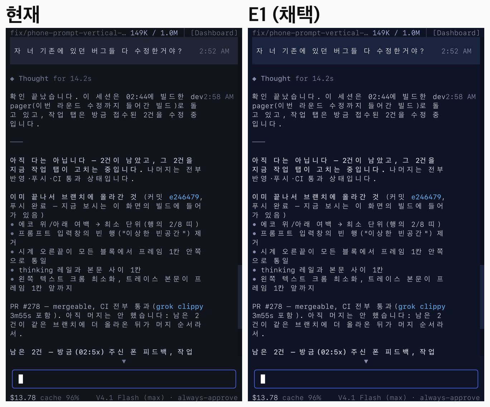
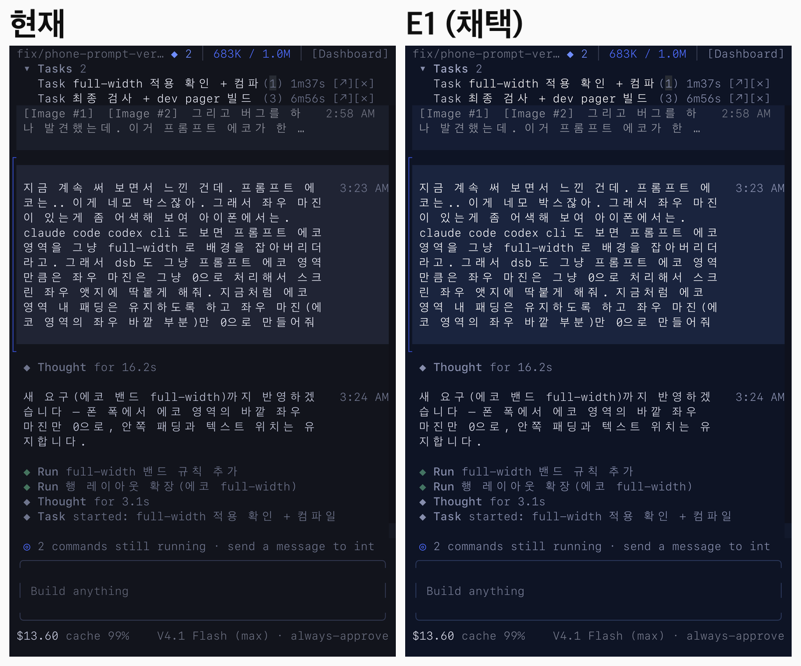

# DeepSeek Night (classic) — glyph-ramp lift for phone legibility (2026-09-27)

> **What this file pins.** The classic `deepseeknight` skin keeps its dark-navy
> ground; legibility is carried by the glyph ramp. The invariants a later
> touch-up must hold: the WCAG floors on `bg_base`, the emphasis/body/tool-row
> CIE L\* gaps, the blue cast of `bg_base`, the scrollbar Σ gap and
> `bg_visual != bg_highlight`. The first two are pinned by tests in
> `third_party/grok-build/crates/codegen/xai-grok-pager-render/src/theme/deepseeknight.rs`;
> the rest by the tests listed below.

| Field | Value |
|-------|--------|
| Date | 2026-09-27 |
| Theme | `/config` → **DeepSeek Night (classic)** — `Theme::deepseeknight()` |
| Changed | `deepseeknight.rs` `mod palette` — the 17 blue-ramp constants |
| Adopted | **E1** |
| Evidence | [`evidence/theme-classic-2026-09-27/`](evidence/theme-classic-2026-09-27/) — 9 lossless WebP + 11 palette JSON |
| Full archive | private WC vault, `assets/images/dsb-classic-theme-2026-09-27/` — original captures, every round, per-screen composites, the preview tools |
| Short version | background stays dark navy, glyphs lift, hierarchy stays |

The classic skin is the product/runtime/config default ([`THEME_V2_REPORT.md`](THEME_V2_REPORT.md)),
and it is the skin the maintainer runs on a phone (Orca iOS). Codex and Claude
Code paint no background and inherit Orca's default, so a tool that paints its
own ground is compared against that — and classic read distinctly darker and
dimmer than its neighbours.

## Problem — what was actually dark

Measured from the maintainer's Orca iOS screenshots (2026-09-27); the classic
values are the palette constants at the time:

| Screen | Background | Body glyph | WCAG 2.1 | APCA Lc |
|--------|-----------|------------|----------|---------|
| Codex · Claude Code (paint no background → Orca default) | `#282C34` (L\* 17.9) | `#FFFFFF` | 14.0 | 104 |
| dsb body — `md_text` = `FG_DARK` | `#12141C` (L\* 6.4) | `#C4C8DC` | 11.07 | 73 |
| dsb tool rows — `gray` = `COMMENT` | `#12141C` | `#6E748C` | **3.97** | 29 |
| dsb `Read N files` — `gray_bright` = `DARK5` | `#12141C` | `#8288A0` | 5.23 | 38 |

Two readings matter. First, the body ratio passed WCAG while reading dim: dark
backgrounds inflate the ratio, while perceived contrast follows the glyph's own
lightness (the concept note behind this is in the WC vault:
`50_learn/frontend/wcag-ratio-passes-while-dark-text-reads-dim.md`). Second,
about half of the glyphs on the screen belong to tool rows (`Run …` /
`Thought for …`), and that gray failed even WCAG AA; Claude's secondary gray
sits at Lc 43–47.

## Candidate rounds

### Round 1 — A · B · C: raise the background (rejected)

Kept the background's hue angle (LCh ≈ 284°) and raised its lightness; glyphs
were shared: body `#E9EBF1`, tool rows `#A2A5B4`.

| Candidate | Background | Note |
|-----------|-----------|------|
| B | `#1D212F` (L\* 12.9) | |
| **A (the round's recommendation)** | `#222636` (L\* 15.4) | |
| C | `#272B3D` (L\* 17.9, Codex's background lightness) | |



**Verdict (meaning):** "A is really bad. If it only keeps getting brighter the
blue cast drains out and it is too bright — it stops looking like a dark theme.
And the boundary between ordinary text and the other text disappears."
The rejected cut's emphasis (`#F8F9FD`) − body (`#E9EBF1`) gap was ΔL\* 5,
against the original theme's 12. Raising the background is off the table.

### Round 2 — D · E · F: keep the background, lift the glyphs

- Glyph ramp, second cut: emphasis L\* 98, body L\* 87 (C 7, slightly blue),
  tool row L\* 59 (C 18, a blue gray).
- Backgrounds: D `#12141C` (unchanged) · E `#111625` (more blue) ·
  F `#141A2B` (one step up).
- Upper surfaces (user block, selection, borders) moved from a **multiplier**
  chroma lift to adding the **same width** — the multiplier made F's user block
  a neon blue.
- Four more screenshots (Tasks panel, status-bar blue numbers, bold text, user
  block, commit-hash blue) joined the set; all five screens got every candidate.



**A question that was answered with pixels:** "D's background is the same? It
looks different." The backgrounds were in fact identical (`#12141C`,
2,338,376 pixels matching); brighter glyphs beside it made the same background
read darker. "E looks okay."

### Round 3 — four E variants

| Candidate | Axis moved | Background | User block |
|-----------|-----------|-----------|------------|
| E | baseline | `#111625` (L\* 7.5, C 11.4) | `#1E263D` |
| **E1 (adopted)** | deeper | **`#0E1425` (L\* 6.6, C 12.9)** | `#1A243E` |
| E2 | hue toward brand blue (h 292) | `#131528` | `#222540` |
| E3 | less blue | `#131621` (C 8.4) | `#20263A` |
| E4 | E background, glyphs one step brighter | `#111625` | body `#DEE0F0`, emphasis − body ΔL\* 8.5 |



**Verdict (meaning):** "good — let's go with E1."

## Decision — E1

Only the blue-tinted classic ramp changes. The neutral ramp, the shared accents,
`DEEPSEEK_BLUE` / `_BRIGHT` / `_DIM`, and `deepseeknight_inner`'s field wiring
are untouched.

| Constant | Role | Old | E1 |
|----------|------|-----|----|
| `BG_STORM` | `bg_base` — the painted ground | `#12141C` | **`#0E1425`** |
| `BG_STORM_DARK` | scrollbar track · `paste_bg` | `#101118` | `#0E111D` |
| `BG_SURFACE` | `bg_dark` | `#181A24` | `#131A2D` |
| `MD_CODE_BG` | code-block background | `#1C1E2A` | `#161E34` |
| `HOVER_BORDER` | hover border | `#1E2230` | `#19223A` |
| `BG_HIGHLIGHT` | user block · `bg_light` · scrollbar thumb | `#202434` | `#1A243E` |
| `BG_HOVER` | hover background | `#282C3E` | `#222C48` |
| `BG_VISUAL` | selection | `#282E46` | `#202E50` |
| `PROMPT_BORDER` | composer border (idle) | `#30364E` | `#293659` |
| `BG` | `bg_terminal` | `#0A0A0E` | `#080A15` |
| `BG_DARK` | unused palette slot | `#0C0C12` | `#090C18` |
| `FG` | `text_primary` — emphasis, user glyphs | `#E8EAF6` | **`#F9F9FC`** |
| `FG_DARK` | `md_text` · `text_secondary` — body | `#C4C8DC` | **`#D7D9E7`** |
| `DARK5` | `gray_bright` · `accent_tool` · h4 | `#8288A0` | `#A4AAC7` |
| `COMMENT` | `gray` — tool rows · h5 · diff equal | `#6E748C` | **`#868DAC`** |
| `DARK3` | h6 | `#5A6078` | `#686E89` |
| `FG_GUTTER` | `gray_dim` — rules · paste dim | `#464A60` | `#474D64` |

On the E1 ground: emphasis 17.45 · body 13.07 (Lc 83) · `gray_bright` 7.99 ·
tool rows 5.60 (Lc 41 — a blue gray) · `gray_dim` 2.19.





## Invariants — what a later touch-up must not break

| Check | Pinned by | E1 |
|-------|-----------|----|
| `text_primary` ≥ 16.0 on `bg_base` (WCAG) | `classic_glyph_ramp_meets_contrast_floors_on_bg_base` (new) | 17.45 |
| `md_text` ≥ 12.0 | same | 13.07 |
| `gray_bright` ≥ 7.5 | same | 7.99 |
| `gray` ≥ 5.2 | same | 5.60 |
| `gray_dim` ≤ 3.0 — rules only | same | 2.19 |
| `text_primary` − `md_text` ≥ 10 (CIE L\*) | `classic_glyph_ramp_keeps_l_star_hierarchy` (new) | 11.1 |
| `md_text` − `gray` ≥ 25 (CIE L\*) | same | 27.9 |
| `bg_base` blue-tinted (`b > r + 5`, `b > g + 5`) | `blue_theme_ramp_is_blue_tinted` | 37 vs 14 / 20 |
| scrollbar thumb − track Σ ≥ 30 | `scrollbar_thumb_contrasts_with_track_in_all_themes` (`theme/mod.rs`) | 64 |
| `bg_visual != bg_highlight` | theme-preview test in `xai-grok-pager/src/views/settings_modal/tests.rs` | distinct |

The two L\* gaps are the direct answer to round 1's rejection — the moment
emphasis and body share one white, the tests fail.

## Reproduce

`scripts/theme-preview/` holds the preview tools (`metrics.py` colorimetry,
`remap.py` the plain pass, `remap2.py` the blend-aware pass; numpy + Pillow).
The five E1 images in the private archive were reproduced from the original
captures with `remap2.py`, pixel-identical (max channel difference 0 across all
five; 0–1,103 unexplained pixels of 2,756,160 per screen):

```bash
python3 scripts/theme-preview/remap2.py \
  --src <original-capture>.webp \
  --old docs/product/evidence/theme-classic-2026-09-27/palettes/current-classic.json \
  --new docs/product/evidence/theme-classic-2026-09-27/palettes/E1.json \
  --out preview.webp --crop 432:2520
```

`--crop` is the terminal region in rows of that capture (1320×2868 phone
screenshots here); omit it for the whole image. Palette JSON maps the ramp
constant names to `[r, g, b]`.

## Preview method and its limits

Each pixel is decomposed as `background + α · (glyph − background)` against the
current palette and recomposed with the candidate — so antialiased glyph edges
follow — and background colors that are a *t*-blend of two ramp colors are
reprojected at the same *t*. Host chrome (Orca's own edges) is left alone.

**The comparison images are not rendered screenshots.** They are the
maintainer's phone captures with the pixels recomposed, so anything the old
palette cannot explain (hardcoded colors, widgets with a different blend rule)
falls back to a shift and looks better than a real build. The real check is the
build on the phone after the merge. For the same reason the images show what
was previewed, not every surface — see the checklist.

## Edge cases for the next touch-up

Screens and roles that the previews did **not** show. When something reads
wrong in daily use, start here.

- [ ] `##` heading `md_heading_h2` = official blue `#4D6BFE` — already weak as a
      glyph (WCAG 4.24 → 4.23, APCA Lc 31). Left out of scope; h1 and links
      (`#6E8CFF`) read 5.99 and code (`#5AA0DC`) 6.54 in the same slots.
- [ ] diff backgrounds `RED_DARK` `#420E14` · `GREEN_DARK` `#063814` — shared
      accents, untouched; their fit on the new navy is unverified.
- [ ] selection `BG_VISUAL` and hover `BG_HOVER` — not in the screenshots.
- [ ] code-block background `MD_CODE_BG`, tables, the h1/h3–h6 heading ladder.
- [ ] paste block (`paste_bg` = `BG_STORM_DARK`, `paste_dim` = `FG_GUTTER`).
- [ ] settings modal, theme picker, scrollbar thumb.
- [ ] 256-color / 16-color terminals (quantized path), Windows
      `windows_contrast_boost` — only truecolor on a phone was measured.
- [ ] phone brightness conditions (outdoors, bright room); the verdict is one
      person's phone.
- [ ] the seam between Orca's own edge strip (`#282C34`) and the new background.

## Trade-offs, stated

- The body does not go to Codex's plain white (Lc 104); it stops at L\* 87 so
  the emphasis boundary stays.
- `gray_dim` deliberately stays below any text floor — it is for rules, not
  glyphs.
- The measured verdicts are one person's phone. APCA is a supporting indicator,
  not a standard.
