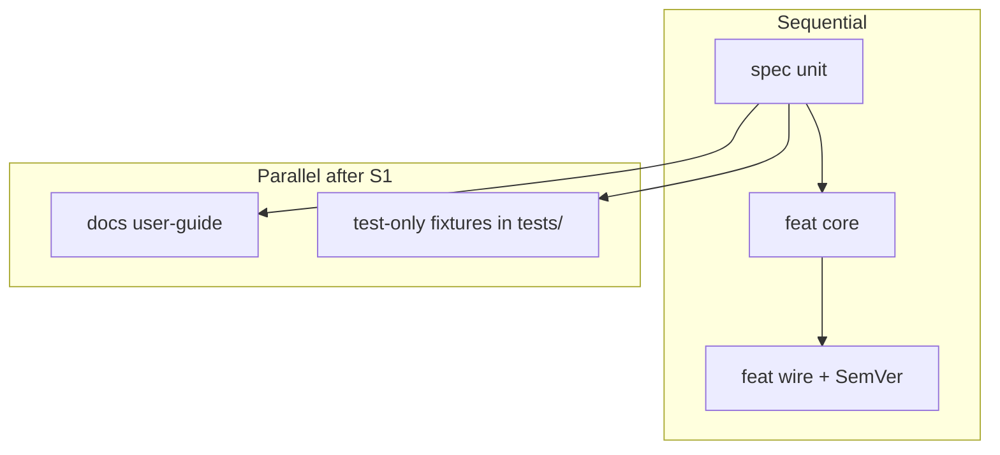
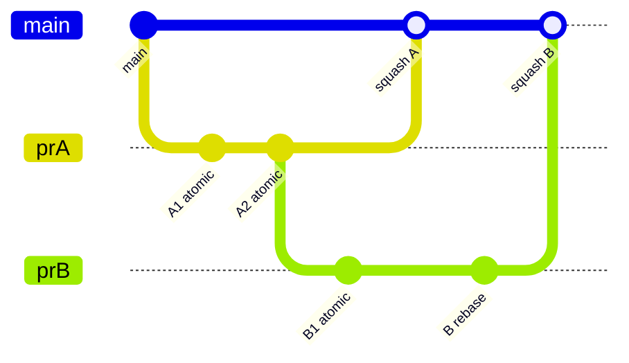

# Ultragoal PR planning (mandatory)

**Normative for every ultragoal story and overnight agent.**  
Companions: [pull-requests.md](../contributing/pull-requests.md) · [commits.md](../contributing/commits.md) · [ULTRAGOAL_CHAIN.md](./ULTRAGOAL_CHAIN.md)

Before writing code for a story, the agent **must** produce a short **PR plan**.  
Without it, do not implement.

---

## 1. Why

Overnight multi-agent work fails when:

| Failure | Result |
|---------|--------|
| One mega-PR for a whole minor | Unreviewable; hard to bisect; squash hides intent |
| Parallel agents touch same files | Merge hell |
| Fat commits (“wip everything”) | Cannot revert one concern |
| Linear only when work was independent | Wastes wall-clock |

So ultragoal always starts with **units**, **DAG**, **atomic commits**, and **stacking when needed**.

---

## 2. Required artifact: PR unit plan

At the **start** of each ultragoal story (and when resuming a story after pull), write (in the PR body of the first PR, or a short `docs/` note only if multi-day) a plan with **all four** sections:

### 2.1 PR units (ordered list)

Each unit = **exactly one mergeable PR** into `main` (or one stack slot — see §4).

Template per unit:

```markdown
### PR unit N — `<type>(scope): short title`
- **Intent:** one sentence
- **Touches:** paths / crates (high level)
- **Depends on:** none | unit K merged (or stacked base)
- **Parallelizable with:** unit ids that do not share files
- **SemVer:** none | patch | part of minor X.Y.Z (only one unit bumps version)
- **Tests:** commands that prove this unit
```

**Rules for a unit**

- One **kind** (`feat|fix|docs|spec|chore|…`) and one review lens  
- Prefer **vertical slice** (behavior + tests) over “all files for a theme”  
- Prefer **S/M** size; split L  
- **At most one** SemVer bump per minor release (dedicated chore/feat release unit or last unit in the minor)

### 2.2 Sequential vs parallel

Explicit two lists:

```markdown
## Sequential (must order)
1. unit A → unit B (reason: B imports A's API)
2. …

## Parallel (safe concurrent)
- unit C ∥ unit D (reason: disjoint crates/docs; no shared lockfiles if possible)
- …
```

**Parallel only if all hold:**

- Disjoint primary paths (or pure docs vs pure code in different trees)  
- No simultaneous edits to `Cargo.toml` / `Cargo.lock` / shared root version  
- No two units both bumping SemVer  
- Spec before code when behavior is new: `spec` unit **before** dependent `feat` units (sequential)



### 2.3 Atomic commits (on the feature branch)

Even with **squash-merge to `main`**, branch history and intermediate pushes should stay **atomic** so:

- Reviewers can read commit-by-commit  
- `git bisect` / revert of a bad step is possible before squash  
- Parallel workers can rebase cleanly  

**Atomic commit means:**

| Do | Do not |
|----|--------|
| One logical change per commit | “WIP”, “fix stuff”, “more” |
| Compiles / tests for that commit when feasible | Broken intermediate commits as the only state |
| Message: Conventional Commits subject | Empty or joke messages |
| Split format-only vs behavior | Mix refactor + feature in one commit |

**Suggested pattern on a unit branch:**

```text
feat(tools): add grep path filter
test(tools): golden cases for grep
docs(user-guide): document grep tool
```

Not:

```text
feat(tools): grep + permissions + version bump + readme rewrite
```

Squash on merge still collapses to one commit on `main` (repo default); atomic **branch** commits remain mandatory for agent discipline.

### 2.4 Chaining / stacking PRs (conflict minimization)

**Prefer stacked (chained) PRs** when work is sequential and large:

| Pattern | When |
|---------|------|
| **Stack** | B needs A's API; A not yet on `main` → base B on A, open PR B → A |
| **Serial merge** | A merges to `main`, pull, then B from `main` (safer if stack tooling weak) |
| **Parallel branches from `main`** | Truly independent units |

**Stacking rules (this repo):**

1. Base branch of PR *n+1* = head of PR *n* (or Graphite/gh stack if available).  
2. Each stack slot remains **one unit** (same size rules).  
3. Rebase stack after `main` moves; do not force-push `main`.  
4. Merge **bottom-up** (A then B); never merge B before A.  
5. After each merge: `git checkout main && git pull` before continuing non-stacked work.  
6. If two parallel agents: assign **disjoint units** from the plan; if both need `Cargo.lock`, **serialize** those units.



**Tooling:** `gh pr create --base <branch>` for stacks; Graphite optional. Document stack order in each PR body (`Depends on #N`).

**Exact squash-stack repair, merge predicates, failure ladder:**  
[stack-merge-runbook.md](../contributing/stack-merge-runbook.md) — **follow it; do not invent rebase steps.**

**Fixed unit lists (do not re-invent overnight):**

- Wave A: [WAVE_A_PR_DAG.md](./WAVE_A_PR_DAG.md)  
- Wave B: [WAVE_B_PR_DAG.md](./WAVE_B_PR_DAG.md)  

---

## 3. Ultragoal story template (append to story start)

Every story checkpoint evidence should be able to point at a plan that looked like:

```markdown
## PR plan for G00X / 0.Y.0

### Units
1. …
2. …

### Sequential
- …

### Parallel
- …

### Stacking
- PR1 (base main) → PR2 (base PR1 branch) → …

### Atomic commit policy
- Conventional Commits; one concern per commit; green tests per unit before PR ready
```

If the agent cannot list **at least one** unit before coding → **stop and plan**.

---

## 4. Anti-patterns (fail-close)

| Anti-pattern | Required fix |
|--------------|--------------|
| Start coding with no PR unit list | Write plan first |
| One PR for entire `0.Y.0` minor with unrelated crates | Split units |
| Parallel PRs both editing `Cargo.toml` version | Serialize version bump unit |
| Non-atomic “dump” commit then open PR | Split commits or explain single-commit unit |
| Stack inverted (merge child first) | Unmerge / fix order |
| “Parallel” workers same files | Reassign disjoint units |

---

## 5. Interaction with squash-merge culture

| Layer | Policy |
|-------|--------|
| **Branch** | Atomic Conventional Commits |
| **`main`** | Squash-merge; PR title = subject on `main` |
| **PR description** | Still Orca-level; list atomic steps if useful |
| **Stack** | Each slot squash-merges in order |

Squash is **not** permission for sloppy branch history during the work.

---

## 6. Checklist before first tool edit of a story

- [ ] PR units listed (N ≥ 1)  
- [ ] Sequential edges explicit  
- [ ] Parallel sets explicit (or “none”)  
- [ ] Stacking strategy chosen  
- [ ] SemVer bump owned by at most one unit  
- [ ] Disjoint file ownership for any parallel agents  
