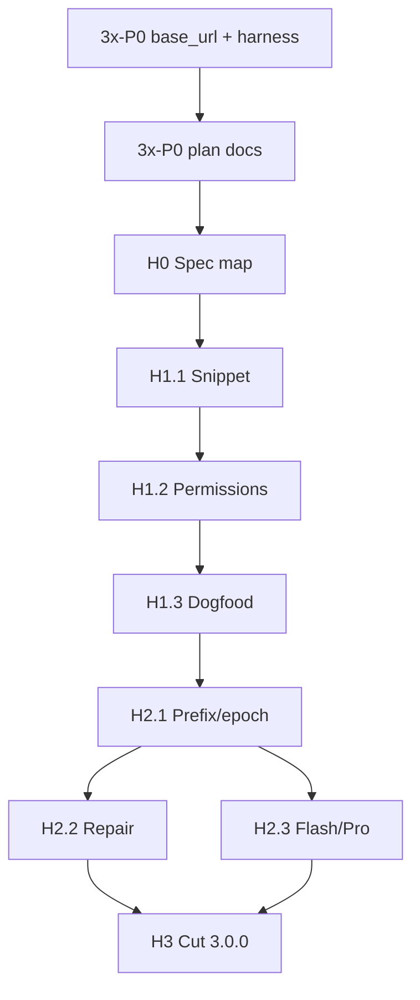

# Wave 3.x PR DAG — heart fusion → **`3.0.0`**

**Normative for product work after 2.x shell cut.**  
**Plan id:** `heart-3x` — story board: [HEART_3X_GOALS.md](./HEART_3X_GOALS.md)  
**PRD:** [PRD-v3.md](./PRD-v3.md)  
**Precondition baseline:** [PRE_3X_TEST_MATRIX.md](./PRE_3X_TEST_MATRIX.md)  
**Do not invent overnight units** — extend this file in a docs PR if the DAG must change.

2.x DAG (`WAVE_2x_PR_DAG.md` / `grokbase-2x`) is **complete for shell**. This DAG owns **L1+L2 hearts under the Grok agent path**.

---

## Legend

| Field | Meaning |
|-------|---------|
| **Unit** | Mergeable PR-sized story |
| **Depends** | Must merge before this unit starts (or stack on top) |
| **Band** | Target SemVer band when unit ships |
| **Evidence** | Required for “done” (not vibes) |

Default merge policy: **serial** unless unit says parallel-safe.  
Repo merge: **squash** ([pull-requests.md](../contributing/pull-requests.md)).  
SemVer: full **`MAJOR.MINOR.PATCH` only**.

---

## Preconditions (not heart fusion code)

| ID | Unit | Depends | Band | Evidence |
|----|------|---------|------|----------|
| **3x-P0-1** | Agent DeepSeek `base_url` + pre-3x test harness | 2.x on `main` | `2.0.x` patch OK | T4.0 green; [PRE3X_BASELINE](./evidence/PRE3X_BASELINE_2026-08-07.md) |
| **3x-P0-2** | This DAG + HEART_3X goals + cold-start prompt on `main` | 3x-P0-1 | docs | Files linked from [ULTRAGOAL_CHAIN.md](./ULTRAGOAL_CHAIN.md) |

**Do not start H002+ while T4.0 (Grok proxy routing) is red on the install under test.**

Everyday regression (no vendor-full):

```bash
./scripts/test-pre3x-baseline.sh --live
```

---

## H0 — Spec map (docs / spec)

| ID | Unit | Depends | Band | Evidence |
|----|------|---------|------|----------|
| **3x-H0-1** | Spec binding map: Spec 45/90/10/15/20 under **Grok tool + context path** (what adapts vs reimplements) | 3x-P0-2 | docs | `docs/architecture/` or `docs/specs/` map + GATES notes if needed |
| **3x-H0-2** | Failure modes + test plan for each P0 heart (red→green checklist) | 3x-H0-1 | docs/spec | Written cases that 3.0.0 cut will require green |

**H0 exit:** Implementers know **which file/crate** owns snippet, perms, prefix, repair, routing under the agent — no greenfield rewrite of Grok.

**Parallel-safe after 3x-P0-2:** none with H0 (serial docs).

---

## H1 — L1 heart (alpha)

| ID | Unit | Depends | Band | Evidence |
|----|------|---------|------|----------|
| **3x-H1-1** | Snippet-safe edit on **default Grok** `search_replace` / edit path (Spec 45 spirit) | H0 exit | `3.0.0-alpha.N` | Automated contract tests fail closed on free-form whole-file primary path |
| **3x-H1-2** | Permissions ask/deny/allow + **headless fail-closed** on that path (Spec 90) | 3x-H1-1 | alpha | TTY vs headless matrix tests; no YOLO-only product default |
| **3x-H1-3** | Dogfood: agent headless edit under DeepSeek with L1 policy on | 3x-H1-2 | alpha | Evidence note under `docs/product/evidence/` |

**H1 exit:** L1 is **true on the real agent tool path**, not only `dsb run` / `dsb-tools`.

---

## H2 — L2 heart (beta)

| ID | Unit | Depends | Band | Evidence |
|----|------|---------|------|----------|
| **3x-H2-1** | Prefix/epoch discipline on **agent context assembly** (Spec 10 spirit) | H1 exit | `3.0.0-beta.N` | Golden or hash-stable tests under Grok stack (not only thin `dsb-context`) |
| **3x-H2-2** | Tool-call repair (Spec 15) on default DeepSeek agent turns | 3x-H2-1 | beta | Repair unit/integration + multi-turn tool live or mock |
| **3x-H2-3** | Flash-first / Pro escalate (Spec 20 spirit) under agent | 3x-H2-1 | beta | Documented routing + dogfoodable switch; may parallel **3x-H2-2** if files disjoint |

**H2 exit:** Reasonix-style economics **control** the agent loop defaults.

**Parallel after 3x-H2-1:** `3x-H2-2` ∥ `3x-H2-3` only if touch sets are disjoint (no dual SemVer bump).

---

## H3 — Product cut (`3.0.0`)

| ID | Unit | Depends | Band | Evidence |
|----|------|---------|------|----------|
| **3x-H3-1** | Honesty docs: README / KNOWN_LIMITS / PRD-v3 claimed-vs-shipped for 3.0.0 | H2 exit | **3.0.0** | Docs match behavior |
| **3x-H3-2** | Pre-3x + heart contract tests green; evidence file for cut | 3x-H3-1 | 3.0.0 | `./scripts/test-pre3x-baseline.sh --live` + heart tests |
| **3x-H3-3** | SemVer **3.0.0** bump (Cargo + package.json) + CHANGELOG + tag `v3.0.0` | 3x-H3-2 | **3.0.0** | Full triple only; npm human-gated (ADR 0007) |

**H3 exit = ship `3.0.0`.** Do not tag earlier.

---

## Explicitly out of this DAG

| Out | Where |
|-----|--------|
| L3 worktree/subagent fleet as product identity | [PRD-v4.md](./PRD-v4.md) / later plan |
| Multi-vendor identity | never product core |
| Gajae multi-stage planning core | non-goal |
| Vendor-full offline as everyday gate | optional; [PRE_3X_TEST_MATRIX.md](./PRE_3X_TEST_MATRIX.md) light default |
| T5 extended Grok surface completeness | optional; not 3.0.0 P0 |
| Skills thrash-free (Spec 70 full) | 3.x minor if non-breaking |

---

## Sequential vs parallel (summary)

```text
3x-P0-1 → 3x-P0-2 → 3x-H0-1 → 3x-H0-2
  → 3x-H1-1 → 3x-H1-2 → 3x-H1-3
  → 3x-H2-1 → (3x-H2-2 ∥ 3x-H2-3 when safe)
  → 3x-H3-1 → 3x-H3-2 → 3x-H3-3 (tag v3.0.0)
```



---

## Status snapshot template

```text
P0 preconditions:  ?/2
H0 spec map:       ?/2
H1 L1 heart:       ?/3
H2 L2 heart:       ?/3
H3 cut 3.0.0:      ?/3
```
