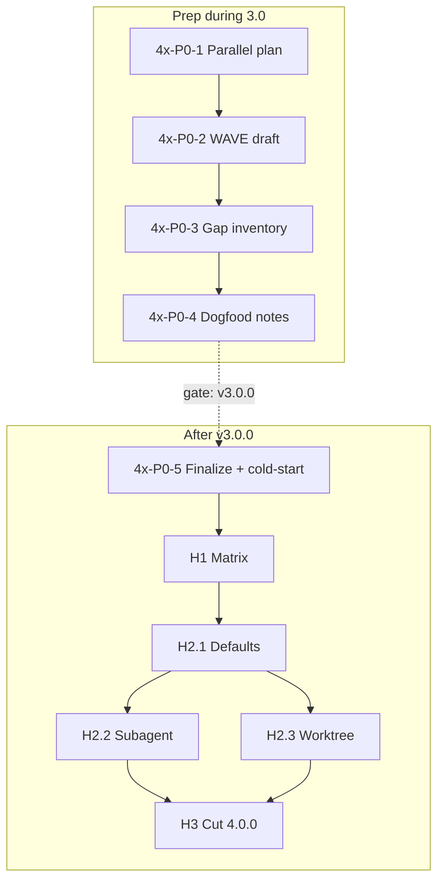

# Wave 4.x PR DAG — L3 productization → **`4.0.0`**

**Status:** **ready-for-impl** (gate: **`v3.0.0`** shipped 2026-08-07)  
**Plan id:** `fleet-4x`  
**PRD:** [PRD-v4.md](./PRD-v4.md)  
**Matrix:** [L3_CAPABILITY_MATRIX.md](./L3_CAPABILITY_MATRIX.md)  
**Parallel ops:** [PARALLEL_3X_4X_PLAN.md](./PARALLEL_3X_4X_PLAN.md)  
**Depends on:** [PRD-v3.md](./PRD-v3.md) / heart-3x complete (tag **`v3.0.0`**)

Do **not** invent overnight units — change this file in a docs PR.

---

## Legend

| Field | Meaning |
|-------|---------|
| **Unit** | Mergeable PR-sized story |
| **Depends** | Must merge first (or stack) |
| **Band** | SemVer band |
| **Phase** | When work is allowed |

Merge: **merge commit** on this repo. Full SemVer only.

---

## Phase gate

| Gate | Requirement |
|------|-------------|
| **Start fleet-4x code** | **OPEN** — `v3.0.0` tagged; this DAG **ready-for-impl**; hearts green |
| **Prep (done during 3.0)** | Units **4x-P0-1..4** landed (Lane B) |

---

## P0 — Prep (allowed **during** 3.0.0 development)

| ID | Unit | Depends | Band | Evidence |
|----|------|---------|------|----------|
| **4x-P0-1** | Parallel ops plan on `main` | — | docs | [PARALLEL_3X_4X_PLAN.md](./PARALLEL_3X_4X_PLAN.md) |
| **4x-P0-2** | This WAVE_4x draft + PRD-v4 cross-links | 4x-P0-1 | docs | This file status = draft |
| **4x-P0-3** | L3 gap inventory (Grok capabilities vs product defaults) | 4x-P0-2 | docs | `docs/research/l3-productization-gap.md` (or equivalent) |
| **4x-P0-4** | DeepSeek dogfood notes for subagent/worktree/bg (**no default change**) | 4x-P0-3 | docs | Evidence under `docs/product/evidence/` |
| **4x-P0-5** | Finalize WAVE_4x → **ready-for-impl** + cold-start 4.0 prompt | **v3.0.0** | docs | Status flip + `ULTRAGOAL_PROMPT_COLD_START_4.0.md` |

**P0 exit (prep):** 4x-P0-1..4 on `main` while hearts still shipping.  
**P0 exit (train start):** 4x-P0-5 after 3.0.0.

---

## H1 — Matrix & honesty (after v3.0.0)

| ID | Unit | Depends | Band | Evidence |
|----|------|---------|------|----------|
| **4x-H1-1** | Capability matrix: parallel tools, bg shell, subagent, worktree — code path + product surface | 4x-P0-5 | `4.0.0-alpha.N` | Doc table + pointers into vendor/product |
| **4x-H1-2** | Heart regression suite still green under agent (45/90/10/15/20 spirit) | 4x-H1-1 | alpha | CI/local commands recorded |
| **4x-H1-3** | KNOWN_LIMITS / README: what 3.0.0 did vs what 4.0 owns | 4x-H1-1 | alpha | Docs honesty |

---

## H2 — Product defaults (L3 as defaults)

| ID | Unit | Depends | Band | Evidence |
|----|------|---------|------|----------|
| **4x-H2-1** | Product defaults / profiles: Grok-native parallel + bg wait patterns (not 1.x shims) | H1 exit | `4.0.0-beta.N` | Config/profile diff + tests; **must not** weaken L1/L2 |
| **4x-H2-2** | Subagent product path dogfoodable (docs + one-shot evidence) | 4x-H2-1 | beta | Evidence note |
| **4x-H2-3** | Worktree product path dogfoodable (docs + evidence) | 4x-H2-1 | beta | Evidence note; may ∥ **4x-H2-2** if files disjoint |

**H2 exit:** Owner can teach “multi-step throughput” as product behavior, not residual Grok lore.

---

## H3 — Cut **`4.0.0`**

| ID | Unit | Depends | Band | Evidence |
|----|------|---------|------|----------|
| **4x-H3-1** | User-guide + README first-class “throughput / fleet” workflows | H2 exit | **4.0.0** | Docs match defaults |
| **4x-H3-2** | Full regression: pre-3x live + heart tests + L3 smoke | 4x-H3-1 | 4.0.0 | Evidence file |
| **4x-H3-3** | SemVer **4.0.0** + CHANGELOG + tag **`v4.0.0`** | 4x-H3-2 | **4.0.0** | Full triple; npm human-gated (ADR 0007) |

---

## Sequential vs parallel

```text
[during heart-3x]
  4x-P0-1 → 4x-P0-2 → 4x-P0-3 → 4x-P0-4

[after v3.0.0]
  4x-P0-5 → 4x-H1-* → 4x-H2-1 → (4x-H2-2 ∥ 4x-H2-3) → 4x-H3-* → tag v4.0.0
```



---

## Explicitly out of 4.0.0

| Out | Where |
|-----|--------|
| Re-opening L1/L2 for speed | Forbidden (HARNESS) |
| Multi-vendor core identity | Non-goal |
| Greenfield agent replace Grok | Non-goal |
| Everyday vendor-full cargo test | PRE_3X light/live only |
| Claiming 4.0.0 from docs-only | Tag requires H2–H3 |

---

## Status snapshot

```text
P0 prep (during 3.0):  complete (Lane B)
H1–H3 (post 3.0):      active under fleet-4x
DAG status:            ready-for-impl
```
