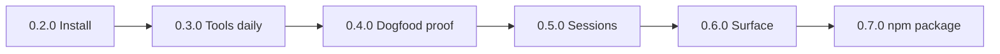

# Wave A — fixed PR unit DAG (`0.2.0`–`0.7.0`)

**Status:** Historical + template for residual work.  
Wave A ultragoal `dogfood-0x` is **complete on `main` through `0.7.0`** (see git).  
This file freezes the **intended unit DAG** so overnight agents never re-invent it, and so Wave B+ copy the pattern.

**SSOT priority:** `goals.json` story status > this DAG for *what is done*; this DAG > free invention for *how to split remaining/future work*.

---

## Global sequencing



**Parallelism inside a minor:** only units marked ∥ (disjoint paths).  
**SemVer bump:** always the **last** unit of that minor (or dedicated release unit).

---

## `0.2.0` Install (shipped)

| Unit | Kind | Touches | Depends | Parallel |
|------|------|---------|---------|----------|
| A | `feat(install)` scripts/install.sh + PATH docs | `scripts/`, README, user-guide | none | — |
| B | SemVer **0.2.0** + train log | Cargo.toml, RELEASE_TRAIN | A | no |

Stack: B on A or single PR if tiny.

---

## `0.3.0` Tools daily (shipped)

| Unit | Kind | Touches | Depends | Parallel |
|------|------|---------|---------|----------|
| A | `feat(tools)` grep | `dsb-tools` | none | ∥ docs |
| B | `feat(tools)` bash execute under policy | `dsb-tools`, agent | none | after A if shared files — **serialize with A** |
| C | `feat(cli)` `--dogfood` profile | `dsb-cli`, config | B | no |
| D | SemVer **0.3.0** + docs | Cargo, README, user-guide | C | no |

---

## `0.4.0` Dogfood proof (shipped)

| Unit | Kind | Touches | Depends | Parallel |
|------|------|---------|---------|----------|
| A | Live dogfood note + evidence | `docs/` | none | — |
| B | SemVer **0.4.0** if needed | Cargo, train log | A | no |

---

## `0.5.0` Sessions (shipped — **required gate path**)

**Gate:** flip **G6a** (spec 100) green **before** runtime session code, or land **spec + runtime in one PR** that flips G6a.

| Unit | Kind | Touches | Depends | Parallel |
|------|------|---------|---------|----------|
| A | `spec(sessions)` **100** ready-for-impl + automated tests plan | `docs/specs/100-*.md`, GATES G6a | none | ∥ docs-only |
| B | `feat(sessions)` JSONL store under `~/.deepseek-build/` | `dsb-agent`/`dsb-config` | A | no |
| C | `feat(sessions)` resume + tool-pair repair on load | agent | B | no |
| D | `docs` user-guide sessions | user-guide | C | ∥ tests |
| E | SemVer **0.5.0** | Cargo, package.json if exists, train | C | no |

**Serial:** A → B → C → E. D ∥ after C.

---

## `0.6.0` Surface min (shipped — **required gate path**)

**Gate:** **G6b** (spec 70) before skills runtime; thinking UX may use existing spec 30.

| Unit | Kind | Touches | Depends | Parallel |
|------|------|---------|---------|----------|
| A | `spec(skills)` **70** ready-for-impl | docs/specs, GATES G6b | none | — |
| B | `feat(skills)` index in stable prefix + on-demand body | context, agent | A | no |
| C | `feat(cli)` thinking/effort flags UX | cli, provider wire | none | ∥ A if no Cargo.lock fight — prefer after B |
| D | SemVer **0.6.0** | Cargo, npm version, docs | B+C | no |

---

## `0.7.0` npm (shipped package; **registry publish = human**)

**Normative design:** [ADR 0007](../adr/0007-npm-packaging.md).

| Unit | Kind | Touches | Depends | Parallel |
|------|------|---------|---------|----------|
| A | `feat(npm)` package.json dual bin + wrappers + postinstall | `package.json`, `npm/` | none | — |
| B | `test`/`docs` version-match script + user-guide 05-npm | scripts, docs | A | ∥ |
| C | SemVer **0.7.0** sync Cargo↔npm | Cargo.toml, package.json | A | no |
| D | **Human gate:** `npm publish` | registry | A–C + smoke | **never agent-complete without evidence** |

**Agent DoD for G007 (complete allowed when):**

```bash
./scripts/check-semver.sh
npm run version-check
# optional: npm pack && npm i -g ./deepseek-build-*.tgz  (or documented path)
deepseek-build --version   # 0.7.0
dsb --version              # 0.7.0
```

**Not required for ultragoal complete:** live `npm publish` (owner OTP). Record `blocked-awaiting-human` if story demanded publish.

---

## Wave A residual / verification

If ledger says complete but smoke fails:

1. Run `./scripts/smoke-dogfood.sh`  
2. Open `fix`/`chore` PR only — do not re-open finished minors without need  
3. Checkpoint evidence: smoke log path  

---

## Copy this pattern for Wave B

See [WAVE_B_PR_DAG.md](./WAVE_B_PR_DAG.md).
