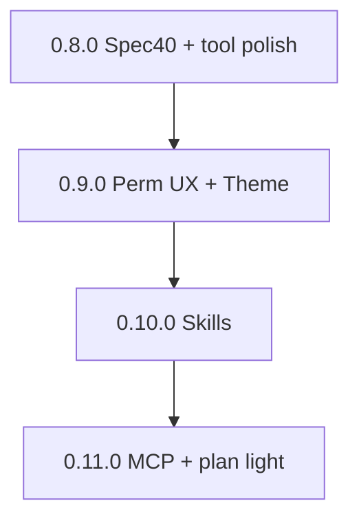

# Wave B — fixed PR unit DAG (`0.8.0`–`0.11.0`)

**Plan id:** `native-0x`  
**PRD:** [prd/PRD-wave-B-native.md](./prd/PRD-wave-B-native.md)  
**Mandatory planning:** [ULTRAGOAL_PR_PLANNING.md](./ULTRAGOAL_PR_PLANNING.md)

Agents **must** use these units (or refine with smaller sub-units, never larger mega-units).

---

## `0.8.0` Spec 40 + tool surface polish

| Unit | Kind | Depends | Notes |
|------|------|---------|-------|
| A | `spec(tools)` **40** ready-for-impl | none | Gate: no G-number required beyond existing; document surface |
| B | `feat(tools)` schema/docs align with 40 | A | |
| C | SemVer **0.8.0** | B | sole version owner |

---

## `0.9.0` Permissions UX + DeepSeek blue theme v1

| Unit | Kind | Depends | Parallel |
|------|------|---------|----------|
| A | `feat(permissions)` TTY ask + allow-once/always | none | ∥ C if no shared files |
| B | `feat(theme)` DeepSeek blue tokens + default readable theme | none | ∥ A |
| C | `docs` DESIGN.md + screenshots | B | after B |
| D | SemVer **0.9.0** | A+B | no |

**Serial version:** A and B may stack from `main` in parallel **only if** disjoint paths (`dsb-tools` vs `dsb-cli` theme). If both touch `Cargo.lock`, **serialize**.

---

## `0.10.0` Skills product

| Unit | Kind | Depends |
|------|------|---------|
| A | Flip/ensure **G6b** + expand spec 70 if needed | none |
| B | `feat(skills)` discovery + cache-safe index | A |
| C | SemVer **0.10.0** | B |

---

## `0.11.0` MCP + light plan

| Unit | Kind | Depends |
|------|------|---------|
| A | Specs **80** + **110** ready-for-impl; **G6c/G6d** green | none |
| B | `feat(mcp)` client + epoch on schema change | A |
| C | `feat(plan)` light non-blocking plan | A |
| D | SemVer **0.11.0** | B+C |

**Stack:** A → B; C may ∥ B if disjoint; D last.
